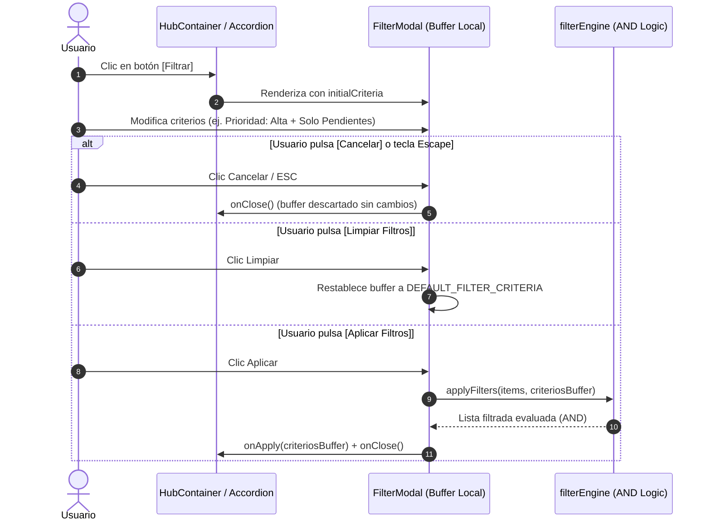

# CENTRA-T · FIA-A06.01 · MODAL DE FILTROS COMBINADOS Y EVALUACIÓN LÓGICA AND

**Proyecto:** Centra-T (Gestor Doméstico Integral y Planificador Temporal)  
**Rebanada Vertical:** RV-A06 · Motor de Filtros Reactivos y Reordenación (Filters & Sort)  
**Estado:** DERIVADA · PENDIENTE DE SPEC, IMPLEMENTACIÓN Y LOCK  
**Hito de Rebanada:** PRIMERA UNIDAD DE RV-A06 (CONTRATOS DE FILTRADO, MOTOR AND PURO Y MODAL DE CONTROL)  
**Regla de Continuidad:** NO LOCK → NO NEXT  

---

### 1. Identificación
- **FIA:** `FIA-A06.01`
- **Rebanada Vertical:** `RV-A06 · Motor de Filtros Reactivos y Reordenación (Filters & Sort)`
- **Unidad Prevista:** `Modal de Filtros Combinados y Evaluación Lógica AND`
- **PVF de Cierre Cubierta:** `PVF-A06.01 · Panel de Filtros Combinados y Lógica AND (Botón [Filtrar])`
- **VF Interna de Derivación:** `VF-A06.01 · Panel de Filtros Combinados y Evaluación Lógica AND`
- **Objetivo Indexado:** `Construir componente modal de filtros desplegable mediante botón [Filtrar] del Hub con selectores de Prioridad, Fecha/Rango y Estado bajo lógica AND acumulativa.`
- **Validación Indexada:** [`src/filters/components/FilterModal.tsx`](file:///home/hnoloh/Escritorio/Centra-T/src/filters/components/FilterModal.tsx)
- **Evidencia de Cierre Indexada:** `Tests RTL verifican apertura de panel, selección de criterios, descarte con botón Cancelar y filtrado preciso sin fugas de estado.`
- **LOCK Previo Requerido:** `LOCK-FIA-A05.03.md APROBADO (FIA-A05.03_AS_BUILT.md)`
- **Estado Documental:** `FIA inicial derivada. No es SPEC, implementación, reporte ni LOCK.`

### 2. Objetivo
Diseñar, implementar y verificar exhaustivamente con TDD el motor de filtrado en cliente y la interfaz modal accesible [`FilterModal.tsx`](file:///home/hnoloh/Escritorio/Centra-T/src/filters/components/FilterModal.tsx), permitiendo al usuario acotar dinámicamente las listas de tareas, compra y limpieza del Hub mediante la combinación lógica acumulativa (**AND**) de tres dimensiones:
1. **Prioridad:** Todas, Alta, Media, Baja.
2. **Fecha / Rango Temporal:** Filtro inactivo, fecha puntual o intervalo acotado [Fecha Inicio, Fecha Fin].
3. **Estado de Ejecución:** Todos, Solo Pendientes, Solo Completadas.
4. **Buffer de Edición Desacoplado:** El usuario puede explorar y ajustar criterios en el modal; presionar `[Cancelar]` o pulsar la tecla `Escape` descarta cualquier manipulación sin alterar la vista activa, mientras que presionar `[Aplicar Filtros]` materializa la nueva vista filtrada y presionar `[Limpiar Filtros]` restaura los criterios por defecto.

### 3. Alcance
- **IN-SCOPE (Obligatorio en esta FIA):**
  - Modelado de contratos y tipos de datos en [`src/filters/types/filter.types.ts`](file:///home/hnoloh/Escritorio/Centra-T/src/filters/types/filter.types.ts) (`FilterCriteria`, `FilterPriority`, `FilterStatus`, `FilterDateRange`).
  - Motor de evaluación determinista puro en [`src/filters/utils/filterEngine.ts`](file:///home/hnoloh/Escritorio/Centra-T/src/filters/utils/filterEngine.ts) con función `evaluateItemFilter(item, criteria): boolean` y `applyFilters(items, criteria): T[]`.
  - Componente modal accesible [`src/filters/components/FilterModal.tsx`](file:///home/hnoloh/Escritorio/Centra-T/src/filters/components/FilterModal.tsx) y su hoja de estilos [`FilterModal.module.css`](file:///home/hnoloh/Escritorio/Centra-T/src/filters/components/FilterModal.module.css).
  - Botón disparador accesible `[Filtrar]` en la barra de herramientas del Hub para desplegar el modal.
  - Gestión defensiva de foco, `aria-modal="true"`, `role="dialog"`, soporte de tecla `Escape` y captura de clic en backdrop.
  - Batería de pruebas unitarias y de integración en Vitest (`filterEngine.test.ts` y `FilterModal.test.tsx`).
- **OUT-OF-SCOPE (Prohibición explícita):**
  - Hook reactivo en memoria `useItemFilters` (asignado estrictamente a `FIA-A06.02`).
  - Menú de ordenación multinivel y componente `SortMenu` (asignado a `FIA-A06.03`).
  - Arrastre interactivo de tarjetas hacia el calendario (pertenece a `RV-A07`).
  - Persistencia de filtros en base de datos o endpoints de backend (los filtros son una capacidad 100% de cliente en memoria).

### 4. Dependencias
- **Documentales:**
  - `SUITE_ARQUITECTURA_CORE.docx` (Doc 05: Module Map - Subsistema filters_and_sort en Frontend).
  - `SUITE_ARQUITECTURA_UI.docx` (Docs 06 y 08: Topología del Hub y Directrices de Botones Secundarios).
  - `Centra-T Pseudocódigo (unificado).odt` (Módulo 5.1: Proceso `Aplicar_Filtros_Combinados_AND`).
  - `CENTRA-T_INDICE_PVF_VF.docx` (PVF-A06.01 y VF-A06.01).
  - `FIA-A05.03_AS_BUILT.md` (Estado físico sellado y congelado).
- **Tecnológicas Autorizadas:**
  - React 18/19, TypeScript estricto, CSS Modules puros consumiendo `src/theme/tokens.css`, Vitest 3.2.7 y Testing Library.
- **Dependencia Secuencial (NO LOCK → NO NEXT):**
  - *Previa:* Requiere el LOCK formal de `FIA-A05.03` (Sellado y verificado con 178 tests en verde).
  - *Posterior:* La unidad `FIA-A06.02` no podrá iniciarse hasta la aprobación formal y LOCK de esta FIA.

### 5. Contratos Afectados
- **Contrato Funcional (PVF-A06.01 / VF-A06.01):**
  - Evaluación acumulativa estricta: `pasaItem = pasaPrioridad AND pasaFecha AND pasaEstado`.
  - Si un ítem falla cualquiera de los 3 criterios, es excluido de la visualización.
  - Al descartar o pulsar Cancelar, no se emite ninguna mutación hacia los observadores de la lista.
- **Contrato de Dominio / Datos:**
  ```typescript
  export type FilterPriority = 'TODAS' | 'alta' | 'media' | 'baja';
  export type FilterStatus = 'TODOS' | 'SOLO_PENDIENTES' | 'SOLO_COMPLETADAS';

  export interface FilterDateCriteria {
    activo: boolean;
    tipo: 'PUNTUAL' | 'RANGO';
    fechaInicio: string | null; // Formato YYYY-MM-DD
    fechaFin: string | null;    // Formato YYYY-MM-DD
  }

  export interface FilterCriteria {
    prioridad: FilterPriority;
    fecha: FilterDateCriteria;
    estado: FilterStatus;
  }
  ```
- **Contrato Físico / Module Map:**
  - Todo nuevo artefacto residirá dentro de `src/filters/` (`types/`, `utils/`, `components/`), respetando la Screaming Architecture sin invadir otros módulos.

### 6. Restricciones
- Prohibido el uso de carpetas cajón de sastre genéricas (`utils/`, `shared/`, `helpers/` en la raíz). Toda lógica auxiliar debe pertenecer a `src/filters/utils/`.
- Prohibido alterar las entidades consolidadas (`TaskItem`, `ShoppingItem`, `CleaningItem`) o añadirles campos espurios para acomodar el filtrado.
- Prohibido realizar llamadas HTTP o alterar el backend: el motor de filtrado opera de forma pura en memoria.
- Directriz WCAG AA: Selector de fechas accesible, inputs con etiqueta asociada y contraste certificado sobre fondo `--bg-card` (`#1A2433`).

### 7. Diseño Técnico
- **Entrada / Punto de Acceso:**
  - Botón `[Filtrar]` accesible integrado en el Hub (con glifo o texto según guía visual).
  - Disparo de `isOpen: true` que monta `FilterModal`.
- **Estructura Interna:**
  - `src/filters/types/filter.types.ts`: Declaración de interfaces y valores iniciales por defecto (`DEFAULT_FILTER_CRITERIA`).
  - `src/filters/utils/filterEngine.ts`: Funciones matemáticas puras `isDateMatching`, `evaluateItemFilter`, `applyFilters`.
  - `src/filters/components/FilterModal.tsx`:
    - Estado de buffer local inicializado con `initialCriteria`.
    - Selector de Prioridad (botones de radio o selector visual).
    - Conmutador y controles de Fecha (checkbox "Filtrar por fecha", selector "Puntual" vs "Rango", selectores `<input type="date">`).
    - Selector de Estado (Todos, Solo pendientes, Solo completadas).
    - Barra inferior de control con `[Cancelar]`, `[Limpiar Filtros]` y `[Aplicar Filtros]`.

### 8. Flujo Operativo


### 9. Casos Válidos (Happy Path & Escenarios Permitidos)
- **Caso 1 (Criterio Neutro / Reset):** Con `prioridad: 'TODAS'`, `fecha.activo: false`, `estado: 'TODOS'`, el evaluador retorna `true` para la totalidad de ítems del array.
- **Caso 2 (Filtro Simple por Prioridad):** Selección de `prioridad: 'alta'`. Solo los ítems con `prioridad === 'alta'` son conservados.
- **Caso 3 (Filtro Simple por Estado):** Selección de `estado: 'SOLO_PENDIENTES'`. Solo los ítems con `completado === false` son conservados.
- **Caso 4 (Combinación AND Doble):** Prioridad `'alta'` AND Estado `'SOLO_PENDIENTES'`. Excluye tareas de prioridad media/baja y también tareas de prioridad alta que ya estén completadas.
- **Caso 5 (Filtro por Fecha Puntual):** Selección de fecha puntual `'2026-10-15'`. Solo retornan los ítems cuya `fechaProgramada` coincide con ese día. Si no tienen fecha, son descartados.
- **Caso 6 (Filtro por Rango de Fechas):** Intervalo `2026-10-01` a `2026-10-07`. Se conservan únicamente los ítems programados dentro de esa franja.
- **Caso 7 (Descarte Seguro):** Modificar controles y pulsar `[Cancelar]` no altera el estado exterior y descarta el buffer.

### 10. Casos Inválidos (Manejo de Excepciones y Rechazos)
- **Caso Inválido 1 (Rango Invertido):** Usuario selecciona `fechaInicio > fechaFin`. El modal despliega un mensaje de error inline y bloquea el botón `[Aplicar Filtros]`.
- **Caso Inválido 2 (Fecha Incompleta):** Se activa el filtro de fecha pero se deja el campo vacío. El evaluador trata el criterio de forma segura sin lanzar excepciones de runtime.
- **Caso Inválido 3 (Array Vacío o Elementos Nulos):** El motor tolera entradas vacías devolviendo un array vacío sin desbordamientos de pila.

### 11. Tests Requeridos
- **Tests Unitarios de Dominio (`filterEngine.test.ts`):**
  - Evaluación aislada de prioridad (todas, alta, media, baja).
  - Evaluación aislada de estado (todos, pendientes, completadas).
  - Evaluación de fechas (puntual, rango, ítems sin fecha).
  - Evaluación combinatoria AND (los 3 criterios simultáneos).
  - Inmutabilidad del array original.
- **Tests de Integración de Componente (`FilterModal.test.tsx`):**
  - Renderizado correcto del modal con sus controles cuando `isOpen={true}`.
  - No renderizado cuando `isOpen={false}`.
  - Selección interactiva de opciones y actualización del buffer local.
  - Cierre inofensivo con tecla `Escape` o botón `[Cancelar]`.
  - Emisión de `onApply` con los criterios seleccionados al pulsar `[Aplicar Filtros]`.
  - Reseteo a valores por defecto al pulsar `[Limpiar Filtros]`.
  - Validación de rango de fecha inválido.

### 12. Quality Gates (QG-FIA-A06.01)
- `QG-FIA-A06.01-01 · Compilación y Tipado:` `tsc --noEmit` superado sin advertencias de tipos.
- `QG-FIA-A06.01-02 · Tests:` 100% de tests unitarios y de integración de la unidad en verde, y cero regresiones en la suite global (mínimo 178 + nuevos tests).
- `QG-FIA-A06.01-03 · Anti-Scope Creep:` Cero llamadas de red mutantes, cero persistencia en base de datos, cero librerías externas superfluas.
- `QG-FIA-A06.01-04 · Verificación Funcional:` Verificación visual y funcional según contrato `PVF-A06.01 / VF-A06.01`.

### 13. Definition of Done (DoD)
Una vez implementada la unidad, se considerará completada si y solo si:
1. Los archivos `filter.types.ts`, `filterEngine.ts`, `FilterModal.tsx` y sus estilos están implementados.
2. Los 4 Quality Gates están certificados con evidencia.
3. Se superan todas las pruebas en Vitest sin saltos ni advertencias.
4. Se generan el `IMPLEMENTATION_REPORT_FIA-A06.01.md` y `TEST_REPORT_FIA-A06.01.md` correspondientes.
