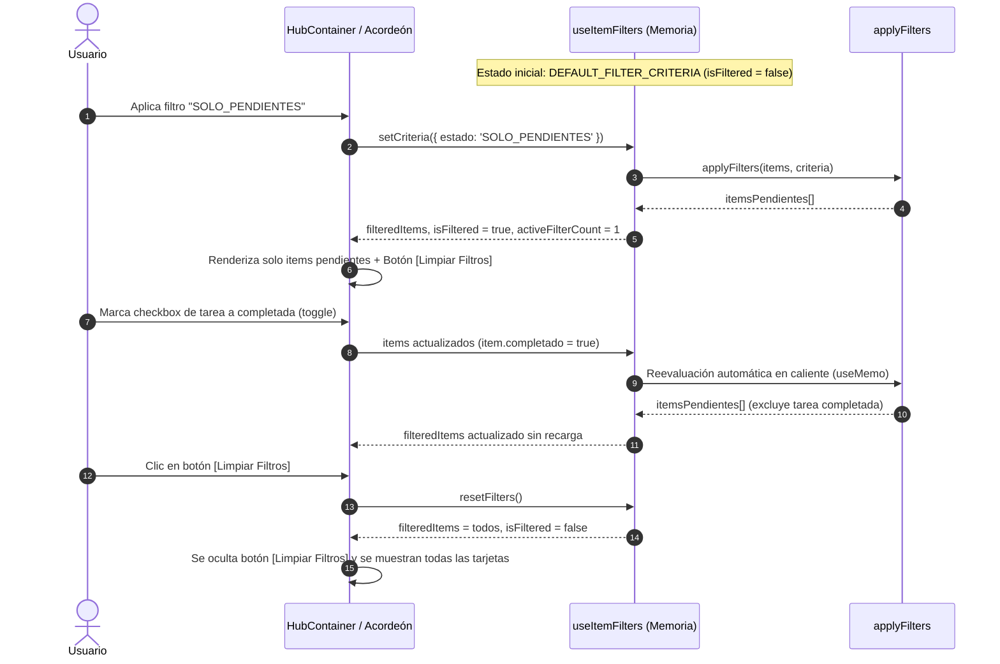

# CENTRA-T · FIA-A06.02 · HOOK USEITEMFILTERS, REACTIVIDAD EN CALIENTE Y BOTÓN [LIMPIAR FILTROS]

**Proyecto:** Centra-T (Gestor Doméstico Integral y Planificador Temporal)  
**Rebanada Vertical:** RV-A06 · Motor de Filtros Reactivos y Reordenación (Filters & Sort)  
**Estado:** DERIVADA · PENDIENTE DE SPEC, IMPLEMENTACIÓN Y LOCK  
**Hito de Rebanada:** SEGUNDA UNIDAD DE RV-A06 (HOOK REACTIVO EN MEMORIA, REACTIVIDAD EN CALIENTE Y BOTÓN DE LIMPIEZA)  
**Regla de Continuidad:** NO LOCK → NO NEXT  

---

### 1. Identificación
- **FIA:** `FIA-A06.02`
- **Rebanada Vertical:** `RV-A06 · Motor de Filtros Reactivos y Reordenación (Filters & Sort)`
- **Unidad Prevista:** `Hook useItemFilters, Reactividad en Caliente y Botón [Limpiar Filtros]`
- **PVF de Cierre Cubierta:** `PVF-A06.02 · Reactividad en Caliente y Botón [Limpiar Filtros]`
- **VF Interna de Derivación:** `VF-A06.02 · Reactividad en Caliente y Reseteo de Filtros`
- **Objetivo Indexado:** `Implementar hook reactivo en memoria que filtra listas de tareas, compra y limpieza ante cambios de estado de ítems, y botón [Limpiar Filtros] para restablecer valores por defecto.`
- **Validación Indexada:** [`src/filters/hooks/useItemFilters.ts`](file:///home/hnoloh/Escritorio/Centra-T/src/filters/hooks/useItemFilters.ts)
- **Evidencia de Cierre Indexada:** `Tests unitarios del hook verifican reevaluación inmediata al mutar un ítem y restauración completa al invocar reset.`
- **LOCK Previo Requerido:** `LOCK-FIA-A06.01.md APROBADO (FIA-A06.01_AS_BUILT.md)`
- **Estado Documental:** `FIA inicial derivada. No es SPEC, implementación, reporte ni LOCK.`

### 2. Objetivo
Construir y verificar con TDD el hook de cliente [`useItemFilters`](file:///home/hnoloh/Escritorio/Centra-T/src/filters/hooks/useItemFilters.ts) para orquestar la reactividad en caliente entre el estado de los filtros y las colecciones de datos del Hub (`tasks`, `shopping`, `cleaning`):
1. **Reactividad en Caliente Inmediata (<16ms):** Ante cualquier mutación de un ítem en memoria (por ejemplo, conmutar el checkbox a completado o cambiar su prioridad), el hook recalcula automáticamente la lista filtrada observable utilizando [`applyFilters`](file:///home/hnoloh/Escritorio/Centra-T/src/filters/utils/filterEngine.ts), actualizando la vista sin recarga de página ni parpadeos.
2. **Telemetría de Estado de Filtro:** Exponer flags booleanos deterministas (`isFiltered`) y contadores de criterios activos (`activeFilterCount`) para que los componentes del Hub informen visualmente al usuario del estado de filtrado.
3. **Mecanismo de Reseteo y Botón [Limpiar Filtros]:** Exponer la función `resetFilters()` y habilitar un control visual accesible `[Limpiar Filtros]` en la interfaz del Hub cuando existan filtros activos (`isFiltered === true`), restaurando instantáneamente la totalidad de las tarjetas a la vista.

### 3. Alcance
- **IN-SCOPE (Obligatorio en esta FIA):**
  - Implementación del hook [`src/filters/hooks/useItemFilters.ts`](file:///home/hnoloh/Escritorio/Centra-T/src/filters/hooks/useItemFilters.ts) tipado genéricamente (`<T extends FilterableItem>`).
  - Memoización del filtrado mediante `useMemo` con dependencias en `[items, criteria]`.
  - Exposición de operaciones atómicas: `setCriteria`, `setPriority`, `setDateCriteria`, `setStatus`, `resetFilters`.
  - Detección de estado activo: `isFiltered = Boolean(prioridad !== 'TODAS' || fecha.activo || estado !== 'TODOS')`.
  - Conteo de filtros activos: `activeFilterCount = (prioridad !== 'TODAS' ? 1 : 0) + (fecha.activo ? 1 : 0) + (estado !== 'TODOS' ? 1 : 0)`.
  - Integración en [`HubContainer.tsx`](file:///home/hnoloh/Escritorio/Centra-T/src/hub/components/HubContainer.tsx) del botón accesible `[Limpiar Filtros]` (o píldora de reseteo) cuando `isFiltered === true`.
  - Suite de pruebas exhaustiva con `renderHook` y pruebas de integración en [`useItemFilters.test.ts`](file:///home/hnoloh/Escritorio/Centra-T/src/filters/hooks/useItemFilters.test.ts).
- **OUT-OF-SCOPE (Prohibición explícita):**
  - Algoritmo de reordenación multinivel y componente `SortMenu` (asignado estrictamente a `FIA-A06.03`).
  - Asignación temporal por Drag & Drop en el calendario (pertenece a `RV-A07`).
  - Persistencia de filtros en base de datos o almacenamiento remoto (los filtros son 100% en memoria del cliente).

### 4. Dependencias
- **Documentales:**
  - `SUITE_ARQUITECTURA_CORE.docx` (Doc 05: Module Map - Subsistema filters_and_sort en Frontend).
  - `SUITE_ARQUITECTURA_UI.docx` (Doc 06: Desacoplamiento de Estado Nivel 2 - UI Client State).
  - `Centra-T Pseudocódigo (unificado).odt` (Módulo 5.1: Proceso `Aplicar_Filtros_Combinados_AND`).
  - `CENTRA-T_INDICE_PVF_VF.docx` (PVF-A06.02 y VF-A06.02).
  - `FIA-A06.01_AS_BUILT.md` (Contratos base de tipos y motor puro `filterEngine.ts`).
- **Tecnológicas Autorizadas:**
  - React 18/19, TypeScript 5.x estricto, Vitest 3.2.7 y `@testing-library/react`.
- **Dependencia Secuencial (NO LOCK → NO NEXT):**
  - *Previa:* Requiere el LOCK formal de `FIA-A06.01` (Sellado y certificado con 212 tests en verde).
  - *Posterior:* La unidad `FIA-A06.03` no podrá iniciarse hasta la aprobación formal y LOCK de esta FIA.

### 5. Contratos Afectados
- **Contrato Funcional (PVF-A06.02 / VF-A06.02):**
  - Si un filtro está activo (ej. `SOLO_PENDIENTES`) y un ítem pasa a `completado = true`, la lista devuelta por el hook expulsa reactivamente ese ítem en caliente.
  - Al pulsar `[Limpiar Filtros]`, el hook restablece `DEFAULT_FILTER_CRITERIA` y la lista filtrada vuelve a contener el 100% de los elementos originales.
- **Contrato de Interfaz del Hook:**
  ```typescript
  export interface UseItemFiltersResult<T> {
    criteria: FilterCriteria;
    filteredItems: T[];
    isFiltered: boolean;
    activeFilterCount: number;
    setCriteria: (criteria: FilterCriteria) => void;
    setPriority: (priority: FilterPriority) => void;
    setDateCriteria: (date: FilterDateCriteria) => void;
    setStatus: (status: FilterStatus) => void;
    resetFilters: () => void;
  }
  ```

### 6. Restricciones
- Inmutabilidad innegociable: `useItemFilters` no muta el array de `items` recibido; siempre retorna nuevas referencias de array al recalcular.
- Optimización de ciclo de vida: el cómputo de `applyFilters` debe encapsularse en `useMemo` para evitar re-renderizados innecesarios si ni la colección ni los criterios cambiaron.
- Prohibida la persistencia en `localStorage` o base de datos: el estado es efímero en memoria durante la sesión del usuario.
- Cero carpetas cajón de sastre globales: el hook debe residir exclusivamente en `src/filters/hooks/`.

### 7. Diseño Técnico
- **Ubicación Física:** [`src/filters/hooks/useItemFilters.ts`](file:///home/hnoloh/Escritorio/Centra-T/src/filters/hooks/useItemFilters.ts).
- **Mecanismo de Reactividad:**
  1. Estado interno de criterios: `const [criteria, setCriteria] = useState<FilterCriteria>(initialCriteria || DEFAULT_FILTER_CRITERIA)`.
  2. Memoización de la lista filtrada:
     ```typescript
     const filteredItems = useMemo(() => {
       return applyFilters(items, criteria);
     }, [items, criteria]);
     ```
  3. Cálculo de telemetría:
     ```typescript
     const isFiltered = useMemo(() => {
       return (
         criteria.prioridad !== 'TODAS' ||
         criteria.fecha.activo ||
         criteria.estado !== 'TODOS'
       );
     }, [criteria]);
     ```
- **Integración Visual:**
  - [`HubContainer.tsx`](file:///home/hnoloh/Escritorio/Centra-T/src/hub/components/HubContainer.tsx) recibe opcionalmente `isFiltered`, `activeFilterCount` y `onClearFilters`, renderizando un botón secundario accesible `[Limpiar Filtros]` o píldora de reset cuando `isFiltered === true`.

### 8. Flujo Operativo


### 9. Casos Válidos (Happy Path & Escenarios Permitidos)
- **Caso 1 (Estado Neutro):** Inicialización sin criterios -> `isFiltered === false`, `activeFilterCount === 0`, `filteredItems.length === items.length`.
- **Caso 2 (Activación de Filtro):** Invocar `setPriority('alta')` -> `isFiltered === true`, `activeFilterCount === 1`, `filteredItems` contiene únicamente ítems de prioridad alta.
- **Caso 3 (Reactividad en Caliente ante Mutación):** Con filtro `SOLO_PENDIENTES` activo, mutar un ítem a `completado: true` en el array `items`. El hook recalcula y el ítem desaparece de `filteredItems` en caliente.
- **Caso 4 (Reactividad ante Inserción):** Añadir un nuevo ítem al array `items`. Si coincide con el criterio activo, aparece automáticamente en `filteredItems`.
- **Caso 5 (Reseteo Completo):** Invocar `resetFilters()` -> `criteria` retorna a `DEFAULT_FILTER_CRITERIA`, `isFiltered === false`, `activeFilterCount === 0`, y `filteredItems` contiene todos los ítems.

### 10. Casos Inválidos (Manejo de Excepciones y Rechazos)
- **Caso Inválido 1 (Colección Nula o Vacía):** El hook maneja `items = []` o entradas no definidas retornando `filteredItems = []` sin errores ni bloqueos.
- **Caso Inválido 2 (Criterios Parciales):** Invocación de `setCriteria` con propiedades incompletas preserva los valores por defecto del resto de campos.

### 11. Tests Requeridos
- **Suite de Pruebas del Hook (`useItemFilters.test.ts`):**
  - Inicialización neutra por defecto.
  - Actualización de criterios mediante `setCriteria`, `setPriority`, `setStatus`, `setDateCriteria`.
  - Recálculo en caliente de `filteredItems` cuando cambian los criterios.
  - Recálculo en caliente de `filteredItems` cuando muta una propiedad de un ítem (`completado`, `prioridad`).
  - Detección precisa de `isFiltered` y cálculo de `activeFilterCount`.
  - Restablecimiento integral al invocar `resetFilters()`.
- **Suite de Integración en Hub:**
  - Renderizado del botón `[Limpiar Filtros]` en `HubContainer` cuando `isFiltered === true`.
  - Invocación de `onClearFilters` al hacer clic en el botón.

### 12. Quality Gates (QG-FIA-A06.02)
- `QG-FIA-A06.02-01 · Compilación y Tipado:` `tsc --noEmit` superado sin errores de tipado.
- `QG-FIA-A06.02-02 · Tests Unitarios y de Integración:` 100% de tests en verde (mínimo 212 + nuevos tests de hook).
- `QG-FIA-A06.02-03 · Anti-Scope Creep:` Cero persistencia en base de datos o almacenamiento persistente; puramente en memoria.
- `QG-FIA-A06.02-04 · Verificación Funcional:` Verificación observable de `PVF-A06.02 / VF-A06.02`.

### 13. Definition of Done (DoD)
La unidad se considerará completada si y solo si:
1. El archivo `src/filters/hooks/useItemFilters.ts` está implementado y probado con 100% de cobertura.
2. La integración de `[Limpiar Filtros]` en `HubContainer.tsx` está validada.
3. Los 4 Quality Gates están superados sin advertencias.
4. Se emiten el `IMPLEMENTATION_REPORT_FIA-A06.02.md` y `TEST_REPORT_FIA-A06.02.md`.
