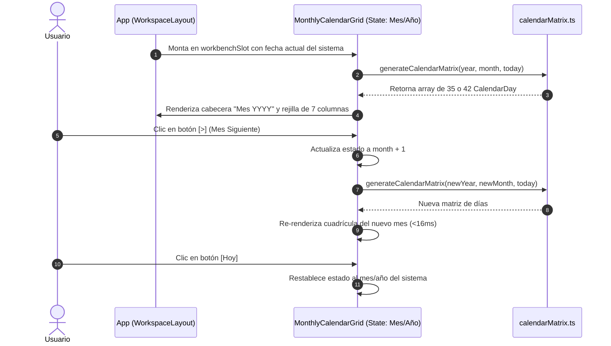

# CENTRA-T · FIA-A07.01 · REJILLA MENSUAL DINÁMICA Y NAVEGACIÓN DE MESES

**Proyecto:** Centra-T (Gestor Doméstico Integral y Planificador Temporal)  
**Rebanada Vertical:** RV-A07 · Calendario Mensual Interactivo y Drag & Drop (Cross-Interaction)  
**Estado:** DERIVADA · PENDIENTE DE SPEC, IMPLEMENTACIÓN Y LOCK  
**Hito de Rebanada:** PRIMERA UNIDAD DE RV-A07 (CUADRÍCULA MENSUAL, MATRIZ TEMPORAL Y NAVEGACIÓN)  
**Regla de Continuidad:** NO LOCK → NO NEXT  

---

### 1. Identificación
- **FIA:** `FIA-A07.01`
- **Rebanada Vertical:** `RV-A07 · Calendario Mensual Interactivo y Drag & Drop (Cross-Interaction)`
- **Unidad Prevista:** `Rejilla Mensual Dinámica y Navegación de Meses`
- **PVF de Cierre Cubierta:** `PVF-A07.01 · Rejilla Mensual Dinámica (7 Columnas L-D) y Navegación de Meses`
- **VF Interna de Derivación:** `VF-A07.01 · Rejilla Mensual Dinámica y Controles Temporales`
- **Objetivo Indexado:** `Construir cuadrícula mensual de 7 columnas (Lunes-Domingo), cálculo dinámico de casillas (35/42 días), días adyacentes atenuados y badge hoy cobalto.`
- **Validación Indexada:** [`src/workspace/components/MonthlyCalendarGrid.tsx`](file:///home/hnoloh/Escritorio/Centra-T/src/workspace/components/MonthlyCalendarGrid.tsx) y [`src/workspace/utils/calendarMatrix.ts`](file:///home/hnoloh/Escritorio/Centra-T/src/workspace/utils/calendarMatrix.ts)
- **Evidencia de Cierre Indexada:** `Navegación calcula correctamente matriz del mes; renderizado de casillas con identificadores de fecha válidos.`
- **LOCK Previo Requerido:** `LOCK-FIA-A06.03.md APROBADO (FIA-A06.03_AS_BUILT.md)`
- **Estado Documental:** `FIA inicial derivada. No es SPEC, implementación, reporte ni LOCK.`

### 2. Objetivo
Diseñar, implementar y verificar con TDD en Vitest la cuadrícula del calendario mensual interactivo ([`MonthlyCalendarGrid.tsx`](file:///home/hnoloh/Escritorio/Centra-T/src/workspace/components/MonthlyCalendarGrid.tsx)), su motor puro de cálculo temporal ([`calendarMatrix.ts`](file:///home/hnoloh/Escritorio/Centra-T/src/workspace/utils/calendarMatrix.ts)) y su montaje en el área de trabajo (`workbenchSlot`) de [`App.tsx`](file:///home/hnoloh/Escritorio/Centra-T/src/App.tsx):
1. **Topología de Cuadrícula Mensual (7 Columnas Lunes a Domingo):**
   - 7 columnas fijas rotuladas canónicamente: `Lun`, `Mar`, `Mié`, `Jue`, `Vie`, `Sáb`, `Dom`.
   - Cálculo dinámico de casillas: genera exactamente 35 días (5 semanas) o 42 días (6 semanas) en función del primer y último día del mes en curso.
2. **Diferenciación Semántica y Visual de Casillas:**
   - **Días del mes activo:** Totalmente legibles con su número de día (`1..31`).
   - **Días adyacentes:** Días residuales del mes anterior y posterior atenuados visualmente con clase `.adjacentMonth` (menor opacidad) para preservar el contexto de semana completa.
   - **Día actual (Hoy):** Indicador visual destacado con badge o aro cobalto semántico (`--accent-cobalt` / `#2563EB`).
   - Cada casilla dispondrá de atributos semánticos para testing y accesibilidad: `data-date="YYYY-MM-DD"`, `data-testid="calendar-cell-YYYY-MM-DD"` y `role="gridcell"`.
3. **Cabecera Temporal y Navegación de Meses:**
   - Muestra el mes y año actual en español (ej. *"Septiembre 2026"*).
   - Botón `[<]` (Mes Anterior) y botón `[>]` (Mes Siguiente) que recalculan instantáneamente la matriz sin parpadeos visuales ni llamadas de red.
   - Botón `[Hoy]` que restablece la vista al mes y año actual del sistema.
4. **Montaje Real en la Aplicación:** Sustituir el placeholder de `workbenchSlot` en [`src/App.tsx`](file:///home/hnoloh/Escritorio/Centra-T/src/App.tsx) por el componente de calendario operativo.

### 3. Alcance
- **IN-SCOPE (Obligatorio en esta FIA):**
  - Utilidad pura [`src/workspace/utils/calendarMatrix.ts`](file:///home/hnoloh/Escritorio/Centra-T/src/workspace/utils/calendarMatrix.ts) con funciones de cálculo de matriz mensual, formato de fecha ISO y detección de día actual.
  - Componente [`src/workspace/components/MonthlyCalendarGrid.tsx`](file:///home/hnoloh/Escritorio/Centra-T/src/workspace/components/MonthlyCalendarGrid.tsx) y estilos [`MonthlyCalendarGrid.module.css`](file:///home/hnoloh/Escritorio/Centra-T/src/workspace/components/MonthlyCalendarGrid.module.css).
  - Montaje interactivo en [`src/App.tsx`](file:///home/hnoloh/Escritorio/Centra-T/src/App.tsx).
  - Suites de pruebas unitarias (`calendarMatrix.test.ts`), de componente (`MonthlyCalendarGrid.test.tsx`) y de integración en `App.test.tsx`.
- **OUT-OF-SCOPE (Preservado para unidades posteriores de RV-A07):**
  - Integración de contexto de Drag & Drop (`dnd-kit`, asignado a `FIA-A07.02`).
  - Bloqueo de fechas pasadas y animación elástica de retorno (Caso `VV-002`, asignado a `FIA-A07.03`).
  - Modal de conflicto en reasignación de fecha (Caso `VV-003`, asignado a `FIA-A07.04`).
  - Arrastre masivo de compra semanal (Caso `VV-006`, asignado a `FIA-A07.05`).
  - Desasignación por clic derecho (Caso `VV-007`, asignado a `FIA-A07.06`).

### 4. Dependencias
- **Documentales:**
  - `SUITE_ARQUITECTURA_CORE.docx` (Doc 01: Identificación y Ficha Técnica).
  - `SUITE_ARQUITECTURA_UI.docx` (Doc 06: Workbench Region / Calendario 67%, y Doc 08: Estilos Visuales).
  - `Centra-T Pseudocódigo (unificado).odt` (Módulo 2.1 y 2.2: Inicialización y Navegación de Meses).
  - `CENTRA-T_INDICE_PVF_VF.docx` (PVF-A07.01 y VF-A07.01).
  - `FIA-A06.03_AS_BUILT.md` (Cierre y sellado definitivo de RV-A06).
- **Tecnológicas Autorizadas:**
  - React 18/19, TypeScript 5.x estricto, CSS Modules puros consumiendo `src/theme/tokens.css`, Vitest 3.2.7 y Testing Library.
- **Dependencia Secuencial (NO LOCK → NO NEXT):**
  - *Previa:* Requiere el LOCK formal de `FIA-A06.03` (Sellado y certificado con 261 tests en verde).
  - *Posterior:* La unidad `FIA-A07.02` no podrá iniciarse hasta la aprobación formal y LOCK de esta FIA.

### 5. Contratos Afectados
- **Contrato Funcional (PVF-A07.01 / VF-A07.01):**
  - 7 columnas fijas Lunes a Domingo.
  - Navegación temporal bidireccional (`[<]` y `[>]`) y botón `[Hoy]`.
  - Recálculo determinista de casillas sin mutaciones destructivas ni parpadeos (CLS = 0).
- **Contrato de Dominio / Datos:**
  ```typescript
  export interface CalendarDay {
    date: Date;
    dateString: string; // Formato ISO YYYY-MM-DD
    dayNumber: number;  // 1..31
    isCurrentMonth: boolean;
    isToday: boolean;
    isPast: boolean;
  }
  ```
- **Contrato Físico:** El calendario ocupa el 67% del ancho del Workspace (`workbenchRegion`, `flex: 1`) sin desbordar el viewport (100vh).

### 6. Restricciones
- Prohibido instalar librerías externas de calendarios (FullCalendar, react-calendar, etc.). El cálculo de matriz debe ser nativo, liviano e inmutable.
- Convención europea estricta: la semana comienza obligatoriamente en **Lunes** (índice 0 o columna 1) y concluye en **Domingo**.
- Erradicación de CLS: el contenedor del calendario debe reservar su altura completa para que el cambio de mes no desplace ningún elemento perimetral.

### 7. Diseño Técnico
- **Utilidad de Matriz Temporal (`src/workspace/utils/calendarMatrix.ts`):**
  - `getMonthName(month: number): string`: Retorna el nombre en español (Enero..Diciembre).
  - `generateCalendarMatrix(year: number, month: number, today?: Date): CalendarDay[]`:
    1. Calcula el primer día del mes y determina cuántos días del mes anterior se requieren para alinear el primer Lunes.
    2. Agrega los días del mes en curso.
    3. Agrega los días del mes siguiente necesarios para completar un bloque regular de 35 o 42 casillas.
- **Componente Visual (`src/workspace/components/MonthlyCalendarGrid.tsx`):**
  - Estado local de visualización: `currentDate: Date` (mes y año en curso).
  - Cabecera: `styles.calendarHeader` con título del mes (`styles.monthTitle`) y grupo de navegación `[<]`, `[Hoy]`, `[>]`.
  - Rejilla de días de la semana: `styles.weekDaysGrid` con etiquetas `L`, `M`, `X`, `J`, `V`, `S`, `D`.
  - Cuadrícula de casillas: `styles.daysGrid` (grid de 7 columnas) renderizando elementos con `role="gridcell"`.

### 8. Flujo Operativo


### 9. Casos Válidos (Happy Path & Escenarios Permitidos)
- **Caso 1 (Renderizado Inicial):** Carga del mes actual mostrando el número correcto de días, etiquetas de Lunes a Domingo y el día de hoy destacado con badge cobalto.
- **Caso 2 (Navegación al Mes Siguiente):** Clic en `[>]` avanza un mes (ej. Septiembre -> Octubre) y actualiza la cabecera y las casillas.
- **Caso 3 (Navegación al Mes Anterior):** Clic en `[<]` retrocede un mes.
- **Caso 4 (Transición de Año):** Avanzar desde Diciembre pasa a Enero del año siguiente; retroceder desde Enero pasa a Diciembre del año anterior.
- **Caso 5 (Botón Hoy):** Estando en un mes futuro o pasado, pulsar `[Hoy]` regresa de inmediato al mes y año actual.

### 10. Casos Inválidos (Manejo de Excepciones y Rechazos)
- **Caso Inválido 1 (Fecha Inválida de Arranque):** Si se suministra una fecha corrupta, el componente recurre de forma defensiva a `new Date()` sin lanzar excepciones de runtime.

### 11. Tests Requeridos
- **Suite de Utilidades (`calendarMatrix.test.ts`):**
  - Generación exacta de 35 o 42 casillas según el mes.
  - Alineación de primer día de semana en Lunes.
  - Marcado correcto de `isCurrentMonth`, `isToday` e `isPast`.
  - Formateo correcto de nombres de mes en español.
- **Suite de Componente (`MonthlyCalendarGrid.test.tsx`):**
  - Renderizado de 7 encabezados de días de la semana (L a D).
  - Presencia del título del mes y año.
  - Navegación interactiva con `[<]` y `[>]`.
  - Retorno al mes en curso con `[Hoy]`.
  - Presencia de atributos `data-date` en cada casilla.
- **Suite de Integración (`App.test.tsx`):**
  - Verificación de que el calendario está montado y visible en el workbench del workspace.

### 12. Quality Gates (QG-FIA-A07.01)
- `QG-FIA-A07.01-01 · Compilación y Tipado:` `tsc --noEmit` superado sin errores.
- `QG-FIA-A07.01-02 · Tests Unitarios y de Integración:` 100% de tests en verde (mínimo 261 + nuevos tests de calendario).
- `QG-FIA-A07.01-03 · Anti-Scope Creep:` Cero código de Drag & Drop en esta unidad (reservado a FIA-A07.02).
- `QG-FIA-A07.01-04 · Verificación Funcional UI:` Comportamiento observable alineado con `PVF-A07.01 / VF-A07.01`.

### 13. Definition of Done (DoD)
La unidad se considerará completada si y solo si:
1. `calendarMatrix.ts`, `MonthlyCalendarGrid.tsx` y estilos están implementados.
2. `MonthlyCalendarGrid` está montado en `App.tsx` y verificado en `App.test.tsx`.
3. Los 4 Quality Gates están superados con 100% de tests en verde.
4. Se emiten el `IMPLEMENTATION_REPORT_FIA-A07.01.md` y `TEST_REPORT_FIA-A07.01.md`.
