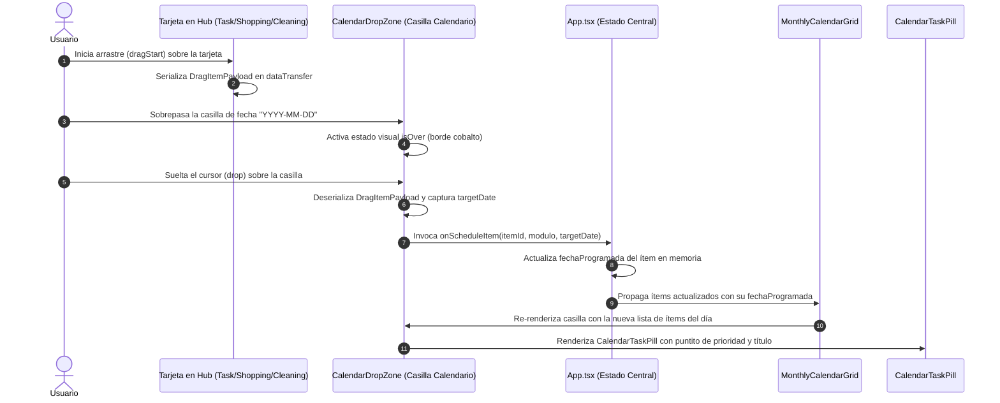

# CENTRA-T · FIA-A07.02 · INFRAESTRUCTURA DRAG & DROP Y ASIGNACIÓN DE ÍTEM

**Proyecto:** Centra-T (Gestor Doméstico Integral y Planificador Temporal)  
**Rebanada Vertical:** RV-A07 · Calendario Mensual Interactivo y Drag & Drop (Cross-Interaction)  
**Estado:** DERIVADA · PENDIENTE DE SPEC, IMPLEMENTACIÓN Y LOCK  
**Hito de Rebanada:** SEGUNDA UNIDAD DE RV-A07 (DRAG & DROP, RECEPTOR DE CASILLA Y MATERIALIZACIÓN DE PÍLDORA)  
**Regla de Continuidad:** NO LOCK → NO NEXT  

---

### 1. Identificación
- **FIA:** `FIA-A07.02`
- **Rebanada Vertical:** `RV-A07 · Calendario Mensual Interactivo y Drag & Drop (Cross-Interaction)`
- **Unidad Prevista:** `Infraestructura Drag & Drop y Asignación de Ítem`
- **PVF de Cierre Cubierta:** `PVF-A07.02 · Asignación de Ítem a Fecha mediante Drag and Drop`
- **VF Interna de Derivación:** `VF-A07.02 · Programación de Ítem en Calendario mediante Drag and Drop`
- **Objetivo Indexado:** `Integrar contexto dnd-kit entre Hub y Calendario. Soltar tarjeta en día válido emite PATCH /items/:id/schedule y materializa píldora en casilla.`
- **Validación Indexada:** [`src/calendar-sync/components/CalendarDropZone.tsx`](file:///home/hnoloh/Escritorio/Centra-T/src/calendar-sync/components/CalendarDropZone.tsx)
- **Evidencia de Cierre Indexada:** `Drop sobre día válido traslada el ítem desde el Hub a la casilla del calendario con actualización de estado en servidor.`
- **LOCK Previo Requerido:** `LOCK-FIA-A07.01.md APROBADO (FIA-A07.01_AS_BUILT.md)`
- **Estado Documental:** `FIA inicial derivada. No es SPEC, implementación, reporte ni LOCK.`

### 2. Objetivo
Diseñar, implementar y verificar con TDD en Vitest la infraestructura de interacción cruzada Drag & Drop entre el panel lateral (Hub) y el planificador mensual (Calendario), materializando el nuevo subsistema `src/calendar-sync/`:
1. **Infraestructura de Arrastre y Soltado (Drag & Drop):**
   - Habilitar capacidades de arrastre (`draggable`) en las tarjetas de ítems del Hub (`TaskCard`, `ShoppingCard`, `CleaningCard`) transportando la carga tipada del ítem (`DragItemPayload`).
   - Crear el componente contenedor receptor [`CalendarDropZone.tsx`](file:///home/hnoloh/Escritorio/Centra-T/src/calendar-sync/components/CalendarDropZone.tsx) integrándolo en cada casilla de la cuadrícula mensual para escuchar eventos de soltado (`drop`).
2. **Materialización Visual de Píldora en el Calendario:**
   - Crear el componente visual [`CalendarTaskPill.tsx`](file:///home/hnoloh/Escritorio/Centra-T/src/calendar-sync/components/CalendarTaskPill.tsx) y sus estilos [`CalendarTaskPill.module.css`](file:///home/hnoloh/Escritorio/Centra-T/src/calendar-sync/components/CalendarTaskPill.module.css).
   - Renderizar de forma compacta y elegante las tareas programadas en la celda del día: puntito sutil de prioridad (7x7px: rojo alta `#EF4444`, ámbar media `#F59E0B`, verde baja `#10B981`), distintivo de módulo y título truncado con elipsis.
3. **Flujo de Asignación y Mutación de Estado:**
   - Al soltar un ítem sobre una casilla con fecha válida (`YYYY-MM-DD`), despachar la asignación de fecha (`onScheduleItem` / `PATCH /items/:id/schedule`).
   - Actualizar el estado en tiempo real en [`App.tsx`](file:///home/hnoloh/Escritorio/Centra-T/src/App.tsx): el ítem recibe su `fechaProgramada` y aparece inmediatamente representado como píldora dentro de la casilla del calendario correspondiente, manteniendo sincronizado el Hub sin parpadeos ni recargas de página.

### 3. Alcance
- **IN-SCOPE (Obligatorio en esta FIA):**
  - Contratos tipados de interacción cruzada en [`src/calendar-sync/types/drag-drop.types.ts`](file:///home/hnoloh/Escritorio/Centra-T/src/calendar-sync/types/drag-drop.types.ts) (`DragItemPayload`, `DropResult`, `CalendarSchedulableItem`).
  - Componente receptor [`src/calendar-sync/components/CalendarDropZone.tsx`](file:///home/hnoloh/Escritorio/Centra-T/src/calendar-sync/components/CalendarDropZone.tsx) con resaltado visual (`isOver`) y suite de pruebas unitarias [`CalendarDropZone.test.tsx`](file:///home/hnoloh/Escritorio/Centra-T/src/calendar-sync/components/CalendarDropZone.test.tsx).
  - Componente de píldora visual [`src/calendar-sync/components/CalendarTaskPill.tsx`](file:///home/hnoloh/Escritorio/Centra-T/src/calendar-sync/components/CalendarTaskPill.tsx) con soporte de prioridad y módulo, junto con sus estilos [`CalendarTaskPill.module.css`](file:///home/hnoloh/Escritorio/Centra-T/src/calendar-sync/components/CalendarTaskPill.module.css) y suite de pruebas [`CalendarTaskPill.test.tsx`](file:///home/hnoloh/Escritorio/Centra-T/src/calendar-sync/components/CalendarTaskPill.test.tsx).
  - Habilitación de arrastre en las tarjetas del Hub (`TaskCard`, `ShoppingCard`, `CleaningCard`) empaquetando el payload canónico.
  - Integración en [`src/workspace/components/MonthlyCalendarGrid.tsx`](file:///home/hnoloh/Escritorio/Centra-T/src/workspace/components/MonthlyCalendarGrid.tsx) para albergar las zonas de soltado y proyectar las píldoras asociadas a cada fecha.
  - Orquestación reactiva de la asignación en [`src/App.tsx`](file:///home/hnoloh/Escritorio/Centra-T/src/App.tsx) y pruebas de integración end-to-end en [`src/App.test.tsx`](file:///home/hnoloh/Escritorio/Centra-T/src/App.test.tsx).
- **OUT-OF-SCOPE (Estrictamente prohibido en esta FIA y reservado a unidades posteriores):**
  - Intercepción y bloqueo de fechas pasadas con animación elástica de retorno (Caso `VV-002`, reservado taxativamente para `FIA-A07.03`).
  - Despliegue de modal de conflicto al reasignar una tarea con fecha previa (Caso `VV-003`, reservado taxativamente para `FIA-A07.04`).
  - Arrastre masivo del contenedor completo de la Compra Semanal (Caso `VV-006`, reservado taxativamente para `FIA-A07.05`).
  - Menú contextual de clic derecho para desasignar la fecha de la píldora (Caso `VV-007`, reservado taxativamente para `FIA-A07.06`).

### 4. Dependencias
- **Documentales:**
  - `SUITE_ARQUITECTURA_CORE.docx` (Doc 05: Module Map - Subsistema `calendar_sync`).
  - `SUITE_ARQUITECTURA_UI.docx` (Doc 07: Feature 08 - Interacción Drag & Drop y Sincronización; Doc 08: Guía de Estilos Visuales; Doc 10: Validación QA).
  - `Centra-T Pseudocódigo (unificado).odt` (Módulo 6: Proceso `Asignar_O_Mover_Fecha_Item_DragDrop`).
  - `CENTRA-T_INDICE_RV_FIA.docx` (Fila FIA-A07.02).
  - `CENTRA-T_INDICE_PVF_VF.docx` (PVF-A07.02 y VF-A07.02).
  - `FIA-A07.01_AS_BUILT.md` (Cierre y sellado formal de la cuadrícula mensual y matriz temporal).
- **Tecnológicas Autorizadas:**
  - React 19.0.0, ReactDOM 19.0.0, TypeScript 5.7.3 estricto, CSS Modules puros consumiendo `tokens.css`, Vitest 3.0.7 y Testing Library.
  - HTML5 Drag and Drop API / `@dnd-kit` nativo sin librerías pesadas ajenas al proyecto.
- **Dependencia Secuencial (NO LOCK → NO NEXT):**
  - *Previa:* Requiere el LOCK formal de `FIA-A07.01` (Sellado y consolidado con 283 tests en verde).
  - *Posterior:* La unidad `FIA-A07.03` no podrá iniciarse hasta la aprobación formal y LOCK de esta FIA.

### 5. Contratos Afectados
- **Contrato Funcional (`PVF-A07.02` / `VF-A07.02`):**
  - Al iniciar arrastre de una tarjeta desde el Hub, el elemento se reconoce como objeto transferible.
  - Al situarse sobre una casilla de día del calendario, la casilla indica receptividad visual (`isOver`).
  - Al soltar la tarjeta sobre la casilla, se extrae el identificador del ítem y la fecha de destino (`dateString`), invocando la asignación.
  - El ítem materializa de inmediato una píldora visual en la casilla correspondiente reflejando su prioridad, módulo y título.
- **Contrato de Dominio / Datos:**
  ```typescript
  export interface DragItemPayload {
    id: string;
    modulo: 'tasks' | 'shopping' | 'cleaning';
    titulo: string;
    prioridad: 'alta' | 'media' | 'baja';
    completado: boolean;
    fechaProgramada?: string | Date | null;
  }

  export interface ScheduleItemDto {
    fechaProgramada: string; // ISO YYYY-MM-DD
  }
  ```
- **Contrato Físico / Module Map:**
  - Todo nuevo componente o contrato de sincronización cruzada debe residir obligatoriamente en `src/calendar-sync/`.

### 6. Restricciones
- Prohibido el uso de carpetas cajón de sastre (`utils/`, `shared/`, `helpers/`). Todo artefacto debe pertenecer a `src/calendar-sync/` o modificar controladamente `src/workspace/` y las tarjetas del Hub.
- Prohibido adelantar el bloqueo de fechas pasadas (Caso VV-002) ni modales de reasignación (Caso VV-003): en esta unidad cualquier casilla de día es un drop target funcional para asentar la infraestructura base.
- Cero librerías externas no declaradas ni emuladores que rompan la compatibilidad con React 19.
- Inmutabilidad estricta: la asignación de fecha genera nuevas referencias de estado en `App.tsx` sin mutar directamente las instancias en memoria.

### 7. Diseño Técnico
- **Entrada / Punto de Acceso:**
  - Invocación de arrastre desde las tarjetas del Hub (`TaskCard`, `ShoppingCard`, `CleaningCard`) en `src/tasks/components/`, `src/shopping/components/`, `src/cleaning/components/`.
  - Invocación de soltado en `CalendarDropZone` dentro de cada celda de `MonthlyCalendarGrid`.
- **Estructura Interna del Módulo `src/calendar-sync/`:**
  - `types/drag-drop.types.ts`: Definición de interfaces tipadas para el payload de transferencia y operaciones de programación temporal.
  - `components/CalendarDropZone.tsx`: Componente receptor con detección de `dragOver`, `dragLeave` y `drop`, emitiendo `onItemDrop(item, targetDate)`.
  - `components/CalendarDropZone.module.css`: Estilos visuales de zona activa (`.dropZoneActive`, borde cobalto discontinuo y fondo con opacidad sutil).
  - `components/CalendarTaskPill.tsx`: Componente visual atómico de píldora de ítem con dot de prioridad (7x7px), etiqueta abreviada y título truncado.
  - `components/CalendarTaskPill.module.css`: Estilizado de píldora (fondo sobrio, bordes redondeados de 4px, altura compacta de 20-22px, tipografía 11px/12px).
- **Manejo de Errores y Tipado:**
  - Extracción y parseo seguro de datos del evento de arrastre con validación de tipo para evitar lecturas de datos corruptos o de orígenes externos no autorizados.
- **Fronteras Físicas Autorizadas:**
  - Creación exclusiva en `src/calendar-sync/*`.
  - Modificación puntual en `src/workspace/components/MonthlyCalendarGrid.tsx` (y su CSS), en las tarjetas de ítems del Hub, y orquestación en `src/App.tsx`.

### 8. Flujo Operativo


### 9. Casos Válidos (Happy Path & Escenarios Permitidos)
- **Caso 1 (Arrastre y Soltado de Tarea):** El usuario arrastra una tarjeta de Tarea no fechada desde el Hub y la suelta en la casilla del día 15 del mes actual; la tarjeta emite la asignación y la casilla muestra la píldora correspondiente con el punto de su prioridad.
- **Caso 2 (Arrastre y Soltado de Compra):** El usuario arrastra un producto del acordeón de Compra hacia una casilla; el producto queda programado y su píldora aparece en el día seleccionado con el distintivo de compra.
- **Caso 3 (Arrastre y Soltado de Limpieza):** El usuario arrastra una tarea de limpieza hacia una casilla; el ítem queda programado y su píldora aparece en el día seleccionado.
- **Caso 4 (Múltiples Píldoras por Casilla):** Al programar varias tareas en la misma fecha, la celda renderiza la lista vertical de píldoras ordenadas sin desbordar destructivamente la cuadrícula.
- **Caso 5 (Feedback Visual de Recepción):** Al sobrevolar una celda durante el arrastre, la celda adquiere el estilo distintivo de zona receptora activa (`isOver`).

### 10. Casos Inválidos (Manejo de Excepciones y Rechazos)
- **Caso Inválido 1 (Soltado Fuera de Zona Válida):** Si el usuario inicia el arrastre pero suelta fuera de cualquier casilla del calendario, el drop se anula sin alterar el estado del ítem ni emitir mutación alguna.
- **Caso Inválido 2 (Payload Corrupto):** Si se dispara un evento drop con datos que no corresponden a un `DragItemPayload` válido, la operación es ignorada de forma silenciosa y segura.
- **Causas de Rechazo Automático:**
  - Fallo en la materialización de la píldora en el calendario.
  - Bloqueo de la interfaz durante el arrastre.
  - Caída de la cobertura de tests o regresiones en las 34 suites previas.

### 11. Tests Requeridos
- **Tests Unitarios de Píldora (`CalendarTaskPill.test.tsx`):**
  - Renderizado del título del ítem.
  - Renderizado del puntito de prioridad con la clase de color correcta (`alta`, `media`, `baja`).
  - Renderizado del identificador de módulo y accesibilidad.
- **Tests Unitarios de Zona de Soltado (`CalendarDropZone.test.tsx`):**
  - Renderizado de hijos dentro de la zona.
  - Activación y desactivación de estilos al disparar `dragOver` y `dragLeave`.
  - Invocación de `onItemDrop` con el payload correcto al disparar `drop`.
- **Tests de Integración en Calendario (`MonthlyCalendarGrid.test.tsx`):**
  - Renderizado de píldoras en las casillas correspondientes según sus fechas programadas.
- **Tests de Integración End-to-End (`App.test.tsx`):**
  - Simulación completa de drag & drop desde el Hub hasta una casilla del calendario, verificando que la píldora queda montada en el DOM de la celda.
- **Evidencia Exigida:** 100% de la suite global en verde (mínimo 283 + nuevos tests de DnD), compilación sin errores y build de producción limpio.

### 12. Quality Gates (QG-FIA-A07.02)
- `QG-FIA-A07.02-01 · Compilación y Tipado:` `tsc --noEmit` superado sin advertencias ni tipos `any`.
- `QG-FIA-A07.02-02 · Tests Unitarios e Integración:` 100% de tests en verde sin regresiones en las 34 suites existentes.
- `QG-FIA-A07.02-03 · Anti-Scope Creep:` Cero código de bloqueo de fechas pasadas (VV-002) ni modales de conflicto (VV-003) en esta unidad.
- `QG-FIA-A07.02-04 · Verificación Funcional UI:` Comportamiento observable alineado estrictamente con `PVF-A07.02 / VF-A07.02`.

### 13. Definition of Done (DoD)
La unidad se considerará completada y lista para LOCK si y solo si:
1. Todos los tipos y componentes de `src/calendar-sync/` están creados y probados.
2. Las tarjetas del Hub soportan arrastre y las celdas del calendario aceptan el soltado.
3. Al soltar una tarjeta en un día, se materializa la píldora correspondiente en la celda y se actualiza el estado en `App.tsx`.
4. Los 4 Quality Gates están superados con 100% de tests en verde.
5. Se emiten el `IMPLEMENTATION_REPORT_FIA-A07.02.md` y `TEST_REPORT_FIA-A07.02.md`.
