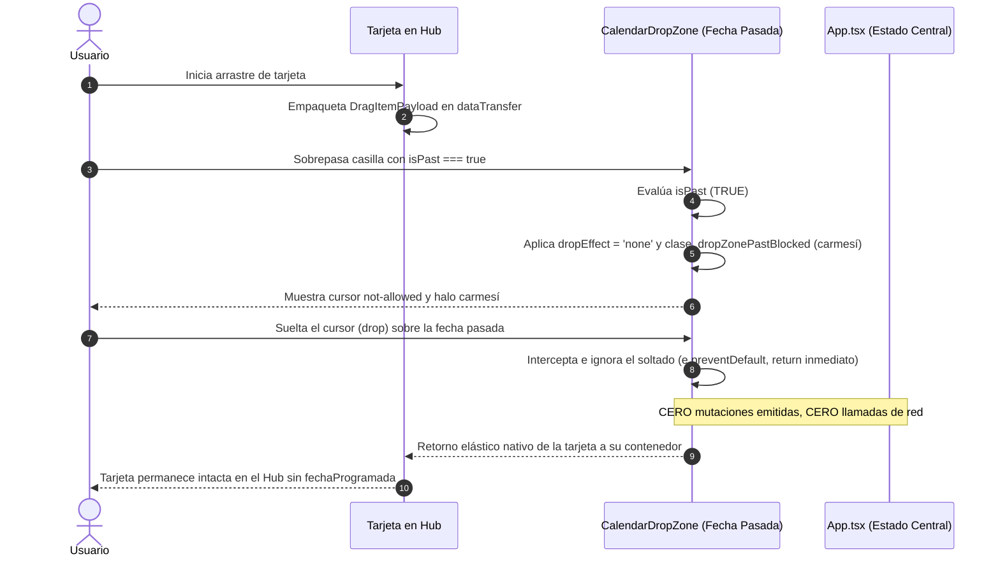

# CENTRA-T · FIA-A07.03 · BLOQUEO FECHAS PASADAS Y RETORNO ELÁSTICO (VV-002)

**Proyecto:** Centra-T (Gestor Doméstico Integral y Planificador Temporal)  
**Rebanada Vertical:** RV-A07 · Calendario Mensual Interactivo y Drag & Drop (Cross-Interaction)  
**Estado:** DERIVADA · PENDIENTE DE SPEC, IMPLEMENTACIÓN Y LOCK  
**Hito de Rebanada:** TERCERA UNIDAD DE RV-A07 (REGLA 1A, AUDITORÍA FORENSE VV-002, FEEDBACK CARMESÍ Y RETORNO ELÁSTICO)  
**Regla de Continuidad:** NO LOCK → NO NEXT  

---

### 1. Identificación
- **FIA:** `FIA-A07.03`
- **Rebanada Vertical:** `RV-A07 · Calendario Mensual Interactivo y Drag & Drop (Cross-Interaction)`
- **Unidad Prevista:** `Bloqueo Fechas Pasadas y Retorno Elástico (VV-002)`
- **PVF de Cierre Cubierta:** `PVF-A07.03 · Bloqueo Inflexible de Drop en Fechas Pasadas (Decisión 1A)`
- **VF Interna de Derivación:** `VF-A07.03 · Bloqueo de Drop en Fechas Pasadas (Decisión 1A / VV-002)`
- **Objetivo Indexado:** `Intercepción de cursor sobre casillas pasadas (cursor not-allowed, tinte carmesí). Soltar anula el drop y activa animación elástica de retorno (Decisión 1A).`
- **Validación Indexada:** [`src/calendar-sync/components/CalendarDropZone.tsx`](file:///home/hnoloh/Escritorio/Centra-T/src/calendar-sync/components/CalendarDropZone.tsx)
- **Evidencia de Cierre Indexada:** `Superación del caso VV-002: cero llamadas de red emitidas; la tarjeta retorna intacta a su contenedor original en el Hub.`
- **LOCK Previo Requerido:** `LOCK-FIA-A07.02.md APROBADO (FIA-A07.02_AS_BUILT.md)`
- **Estado Documental:** `FIA inicial derivada. No es SPEC, implementación, reporte ni LOCK.`

### 2. Objetivo
Diseñar, implementar y verificar con TDD en Vitest el cumplimiento estricto e inflexible de la **Decisión Arquitectónica 1A** y la validación forense **VV-002** en la interacción Drag & Drop:
1. **Detección e Intercepción en Casillas de Fechas Pasadas:**
   - Aprovechar el indicador temporal inmutable `isPast: boolean` proporcionado por el motor `calendarMatrix.ts` y propagado a cada [`CalendarDropZone`](file:///home/hnoloh/Escritorio/Centra-T/src/calendar-sync/components/CalendarDropZone.tsx).
2. **Feedback Visual Preventivo durante el Arrastre:**
   - Al sobrevolar con una tarjeta arrastrada una casilla cuyo día es estrictamente anterior a la fecha actual del sistema (`isPast === true`), la casilla **NO** se ilumina como zona válida (`isOver = false`).
   - Se activa la clase visual de bloqueo carmesí [`.dropZonePastBlocked`](file:///home/hnoloh/Escritorio/Centra-T/src/calendar-sync/components/CalendarDropZone.module.css) con tinte carmesí sutil (`rgba(239, 68, 68, 0.12)` / `--accent-crimson-subtle`), borde discontinuo de advertencia (`#EF4444`) y cursor `not-allowed`.
   - Se fija `e.dataTransfer.dropEffect = 'none'` informando al sistema operativo y al navegador del rechazo de la zona.
3. **Anulación Inflexible del Soltado (`drop`) y Retorno Elástico:**
   - Si el usuario suelta el cursor sobre la casilla pasada, la operación se cancela taxativamente (`e.preventDefault()`).
   - **Cero peticiones de red y cero mutaciones de estado:** no se invoca `onItemDrop`, ni se altera `fechaProgramada`.
   - La tarjeta del Hub retorna elásticamente intacta a su contenedor de origen sin parpadeos ni desplazamientos fantasma.
   - Mostrar opcionalmente un aviso preventivo discreto o toast contextual: *"No se pueden programar tareas en fechas pasadas"* (según la directriz formal zug-DSL).

### 3. Alcance
- **IN-SCOPE (Obligatorio en esta FIA):**
  - Modificación de [`src/calendar-sync/components/CalendarDropZone.tsx`](file:///home/hnoloh/Escritorio/Centra-T/src/calendar-sync/components/CalendarDropZone.tsx) para condicionar `handleDragOver`, `handleDragEnter`, `handleDragLeave` y `handleDrop` en función de `isPast`.
  - Incorporación en [`src/calendar-sync/components/CalendarDropZone.module.css`](file:///home/hnoloh/Escritorio/Centra-T/src/calendar-sync/components/CalendarDropZone.module.css) de la clase de bloqueo carmesí `.dropZonePastBlocked` y estilo `cursor: not-allowed`.
  - Actualización de [`MonthlyCalendarGrid.tsx`](file:///home/hnoloh/Escritorio/Centra-T/src/workspace/components/MonthlyCalendarGrid.tsx) garantizando la propagación limpia de `isPast={day.isPast}` a cada celda.
  - Pruebas unitarias completas del caso `VV-002` en [`CalendarDropZone.test.tsx`](file:///home/hnoloh/Escritorio/Centra-T/src/calendar-sync/components/CalendarDropZone.test.tsx), [`MonthlyCalendarGrid.test.tsx`](file:///home/hnoloh/Escritorio/Centra-T/src/workspace/components/MonthlyCalendarGrid.test.tsx) y prueba de integración E2E en [`src/App.test.tsx`](file:///home/hnoloh/Escritorio/Centra-T/src/App.test.tsx).
- **OUT-OF-SCOPE (Estrictamente prohibido en esta FIA y reservado a unidades posteriores):**
  - Modal de conflicto al mover tareas que ya poseían una fecha asignada (Caso `VV-003`, reservado taxativamente para `FIA-A07.04`).
  - Arrastre masivo del contenedor completo de la Compra Semanal (Caso `VV-006`, reservado taxativamente para `FIA-A07.05`).
  - Menú contextual de clic derecho para desasignar fecha de la pastilla (Caso `VV-007`, reservado taxativamente para `FIA-A07.06`).

### 4. Dependencias
- **Documentales:**
  - `SUITE_ARQUITECTURA_CORE.docx` (Doc 05: Module Map - Subsistema `calendar_sync`).
  - `SUITE_ARQUITECTURA_UI.docx` (Doc 07: Feature 08 - Bloqueo de Fechas Pasadas / Decisión 1A; Doc 08: Estilos Visuales; Doc 10: Auditoría Forense QA, Escenario VV-002).
  - `Centra-T Pseudocódigo (unificado).odt` (Módulo 6: Proceso `Asignar_O_Mover_Fecha_Item_DragDrop` - Paso 1: `Validacion_De_Frontera_Temporal`).
  - `CENTRA-T_INDICE_RV_FIA.docx` (Fila FIA-A07.03).
  - `CENTRA-T_INDICE_PVF_VF.docx` (PVF-A07.03 y VF-A07.03).
  - `FIA-A07.02_AS_BUILT.md` (Cierre y sellado formal de la infraestructura Drag & Drop base).
- **Tecnológicas Autorizadas:**
  - React 19.0.0, ReactDOM 19.0.0, TypeScript 5.7.3 estricto, CSS Modules puros con `tokens.css`, Vitest 3.2.7 y Testing Library.
  - API nativa HTML5 Drag and Drop (`dropEffect = 'none'`).
- **Dependencia Secuencial (NO LOCK → NO NEXT):**
  - *Previa:* Requiere el LOCK formal de `FIA-A07.02` (Sellado y consolidado con 302 tests en verde).
  - *Posterior:* La unidad `FIA-A07.04` (Modal de conflicto VV-003) no podrá iniciarse hasta la aprobación formal y LOCK de esta FIA.

### 5. Contratos Afectados
- **Contrato Funcional (`PVF-A07.03` / `VF-A07.03` / Decisión 1A / VV-002):**
  - Casillas con fecha anterior al día presente no admiten soltado de tareas bajo ninguna circunstancia.
  - Al posicionar el cursor sobre una casilla pasada: `dropEffect = 'none'`, clase visual carmesí `.dropZonePastBlocked` y cursor `not-allowed`.
  - Al soltar sobre una casilla pasada: la operación se cancela sin invocar `onItemDrop`, sin llamadas de red y con retorno elástico de la tarjeta al Hub.
- **Contrato de Interfaz Visual:**
  - `.dropZonePastBlocked`: Borde carmesí discontinuo (`#EF4444`), fondo sutil translúcido (`rgba(239, 68, 68, 0.10)` a `rgba(239, 68, 68, 0.15)`), cursor explícito `not-allowed`.

### 6. Restricciones
- Prohibido relajar la regla de bloqueo temporal: ni tareas, ni compras, ni limpiezas pueden soltarse en días pasados.
- Prohibido emitir peticiones HTTP (PATCH / schedule) o alterar el array de ítems cuando el soltado ocurra en una casilla pasada.
- Cero librerías externas de drag & drop: control 100% nativo mediante eventos HTML5.
- Cero implementación anticipada de modales de conflicto (VV-003) o desasignación (VV-007).

### 7. Diseño Técnico
- **Entrada / Punto de Acceso:**
  - Componente [`CalendarDropZone.tsx`](file:///home/hnoloh/Escritorio/Centra-T/src/calendar-sync/components/CalendarDropZone.tsx).
- **Lógica de Intercepción en `CalendarDropZone.tsx`:**
  - Estado interno adicional: `isBlocked: boolean` (o cálculo derivado durante `dragOver` cuando `isPast === true`).
  - En `handleDragOver`:
    ```typescript
    if (isPast) {
      e.preventDefault();
      e.dataTransfer.dropEffect = 'none';
      if (!isBlocked) setIsBlocked(true);
      if (isOver) setIsOver(false);
      return;
    }
    ```
  - En `handleDragLeave`:
    ```typescript
    setIsBlocked(false);
    setIsOver(false);
    ```
  - En `handleDrop`:
    ```typescript
    e.preventDefault();
    setIsBlocked(false);
    setIsOver(false);
    if (isPast) {
      // Bloqueo innegociable Decisión 1A: Cero mutaciones, cero efectos
      return;
    }
    ```
- **Fronteras Físicas Autorizadas:**
  - Modificación de `src/calendar-sync/components/CalendarDropZone.tsx` y su CSS.
  - Modificación de `src/workspace/components/MonthlyCalendarGrid.tsx` y pruebas asociadas.
  - Verificación en `src/App.test.tsx`.

### 8. Flujo Operativo


### 9. Casos Válidos (Happy Path & Escenarios Permitidos)
- **Caso 1 (Arrastre sobre Día Pasado):** Al sobrevolar una casilla anterior a hoy, la casilla muestra el tinte carmesí y cursor `not-allowed`.
- **Caso 2 (Soltado sobre Día Pasado - Caso VV-002):** Al soltar el cursor sobre una casilla pasada, la acción se anula completamente: no se ejecuta `onItemDrop`, la píldora no aparece en la celda y la tarjeta retorna a su contenedor en el Hub.
- **Caso 3 (Preservación del Soltado en Fechas Válidas):** Al sobrevolar una casilla de hoy o fecha futura (`isPast === false`), se mantiene la activación azul cobalto (`.dropZoneActive`, `dropEffect = 'move'`) y el soltado materializa la píldora normalmente.

### 10. Casos Inválidos (Manejo de Excepciones y Rechazos)
- **Caso Inválido 1 (Tentativa de Drop Forzado):** Si un evento de drop es disparado sintéticamente sobre una casilla pasada, la guarda `if (isPast) return;` bloquea la propagación de datos.
- **Causas de Rechazo Automático:**
  - Materialización de píldora en casillas pasadas.
  - Modificación de `fechaProgramada` en el estado de la aplicación tras soltar en día pasado.
  - Ruptura de los 302 tests existentes.

### 11. Tests Requeridos
- **Suite de Zona de Soltado (`CalendarDropZone.test.tsx`):**
  - Prueba de `dragOver` en casilla pasada activa cursor `not-allowed` / `dropEffect = 'none'` y estilo `.dropZonePastBlocked`.
  - Prueba de `drop` en casilla pasada no ejecuta `onItemDrop`.
  - Prueba de `dragLeave` en casilla pasada limpia el estado de bloqueo.
- **Suite de Calendario (`MonthlyCalendarGrid.test.tsx`):**
  - Casillas con `isPast` bloquean el soltado y casillas presentes/futuras lo permiten.
- **Suite E2E en App (`App.test.tsx`):**
  - Auditoría forense `VV-002`: Arrastrar una tarjeta del Hub a un día pasado cancela el drop, no muta la tarea y no crea la píldora en el calendario.
- **Evidencia Exigida:** 100% de tests en verde (mínimo 315+ tests totales en 36 suites).

### 12. Quality Gates (QG-FIA-A07.03)
- `QG-FIA-A07.03-01 · Compilación y Tipado:` `tsc --noEmit` superado con 0 errores.
- `QG-FIA-A07.03-02 · Tests Unitarios e Integración:` 100% de tests en verde sin regresiones.
- `QG-FIA-A07.03-03 · Anti-Scope Creep:` Cero código de modal de conflicto (VV-003) en esta unidad.
- `QG-FIA-A07.03-04 · Verificación Funcional UI:` Superación demostrada del caso forense `VV-002`.

### 13. Definition of Done (DoD)
La unidad se considerará completada y lista para LOCK si y solo si:
1. `CalendarDropZone.tsx` bloquea con feedback carmesí y cursor `not-allowed` el arrastre sobre días pasados.
2. El soltado sobre días pasados queda taxativamente anulado con retorno de la tarjeta sin mutación.
3. Se supera con evidencia de test el escenario forense `VV-002`.
4. Los 4 Quality Gates están superados con 100% de tests en verde.
5. Se emiten el `IMPLEMENTATION_REPORT_FIA-A07.03.md` y `TEST_REPORT_FIA-A07.03.md`.
