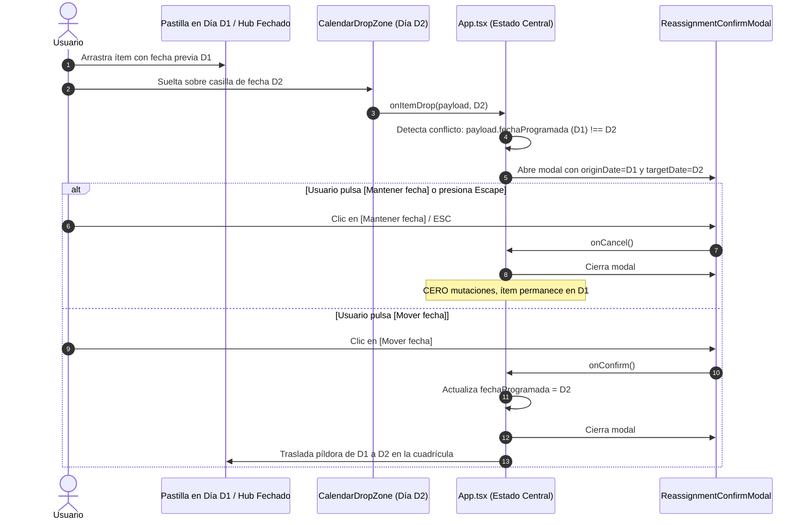

# CENTRA-T · FIA-A07.04 · MODAL CONFLICTO EN REASIGNACIÓN DE FECHA (VV-003)

**Proyecto:** Centra-T (Gestor Doméstico Integral y Planificador Temporal)  
**Rebanada Vertical:** RV-A07 · Calendario Mensual Interactivo y Drag & Drop (Cross-Interaction)  
**Estado:** DERIVADA · PENDIENTE DE SPEC, IMPLEMENTACIÓN Y LOCK  
**Hito de Rebanada:** CUARTA UNIDAD DE RV-A07 (REGLA 4B, INTERCEPCIÓN MODAL DE CONFLICTO, AUDITORÍA FORENSE VV-003)  
**Regla de Continuidad:** NO LOCK → NO NEXT  

---

### 1. Identificación
- **FIA:** `FIA-A07.04`
- **Rebanada Vertical:** `RV-A07 · Calendario Mensual Interactivo y Drag & Drop (Cross-Interaction)`
- **Unidad Prevista:** `Modal Conflicto en Reasignación de Fecha (VV-003)`
- **PVF de Cierre Cubierta:** `PVF-A07.04 · Modal de Confirmación al Mover Tarea Fechada (Decisión 4B)`
- **VF Interna de Derivación:** `VF-A07.04 · Modal de Intercepción en Reasignación de Fecha (Decisión 4B / VV-003)`
- **Objetivo Indexado:** `Detectar arrastre de ítem previamente fechado hacia nuevo día. Desplegar obligatoriamente modal de conflicto con fecha origen vs destino (Decisión 4B).`
- **Validación Indexada:** [`src/calendar-sync/components/ReassignmentConfirmModal.tsx`](file:///home/hnoloh/Escritorio/Centra-T/src/calendar-sync/components/ReassignmentConfirmModal.tsx)
- **Evidencia de Cierre Indexada:** `Superación del caso VV-003: pulsar Mantener o presionar ESC aborta el cambio; confirmar ejecuta la reasignación en servidor.`
- **LOCK Previo Requerido:** `LOCK-FIA-A07.03.md APROBADO (FIA-A07.03_AS_BUILT.md)`
- **Estado Documental:** `FIA inicial derivada. No es SPEC, implementación, reporte ni LOCK.`

### 2. Objetivo
Diseñar, implementar y verificar con TDD en Vitest el cumplimiento riguroso de la **Decisión Arquitectónica 4B** y la validación forense **VV-003** para prevenir la reprogramación o reubicación temporal accidental de tareas en el planificador:
1. **Detección de Conflicto Temporal en Arrastre:**
   - Detectar cuando un ítem que ya posee una fecha asignada (`fechaProgramada !== null`) es arrastrado y soltado sobre una casilla de fecha válida distinta (`targetDate !== originDate`).
   - El arrastre puede originarse tanto desde una tarjeta del Hub con fecha previa como entre casillas del calendario mediante el arrastre de su pastilla (`CalendarTaskPill`).
2. **Componente de Diálogo Modal Accesible (`ReassignmentConfirmModal.tsx`):**
   - Modal flotante centrado con backdrop oscuro semitransparente (`rgba(0, 0, 0, 0.6)`), `role="dialog"`, `aria-modal="true"`.
   - Mensaje explícito de conflicto: *"Esta tarea ya está asignada al [Fecha Origen]. ¿Deseas moverla al [Fecha Destino]?"*.
   - Botón secundario preventivo `[Mantener fecha]` (o `[Cancelar]`) con foco seguro predeterminado y soporte de tecla `Escape`.
   - Botón primario `[Mover fecha]` (o `[Confirmar]`) para ratificar la reasignación.
3. **Orquestación Reactiva en [`App.tsx`](file:///home/hnoloh/Escritorio/Centra-T/src/App.tsx):**
   - Al soltar un ítem ya fechado en un nuevo día, el cambio queda pausado en buffer pendiente y se abre el modal.
   - Si el usuario pulsa `[Mantener fecha]` o presiona `Escape`: el modal se cierra, la operación se cancela sin mutación alguna y el ítem conserva su fecha original D1.
   - Si el usuario pulsa `[Mover fecha]`: el modal se cierra, se ejecuta la mutación y la pastilla se traslada de D1 a D2 en la cuadrícula mensual.
   - Si el ítem no poseía fecha previa, la asignación se efectúa de forma directa sin desplegar modal alguno (comportamiento de `FIA-A07.02`).

### 3. Alcance
- **IN-SCOPE (Obligatorio en esta FIA):**
  - Componente modal [`src/calendar-sync/components/ReassignmentConfirmModal.tsx`](file:///home/hnoloh/Escritorio/Centra-T/src/calendar-sync/components/ReassignmentConfirmModal.tsx) y estilos [`ReassignmentConfirmModal.module.css`](file:///home/hnoloh/Escritorio/Centra-T/src/calendar-sync/components/ReassignmentConfirmModal.module.css).
  - Suite de pruebas unitarias [`ReassignmentConfirmModal.test.tsx`](file:///home/hnoloh/Escritorio/Centra-T/src/calendar-sync/components/ReassignmentConfirmModal.test.tsx).
  - Habilitación de arrastre (`draggable`) en [`CalendarTaskPill.tsx`](file:///home/hnoloh/Escritorio/Centra-T/src/calendar-sync/components/CalendarTaskPill.tsx) para permitir mover tareas directamente entre días del calendario.
  - Orquestación en [`src/App.tsx`](file:///home/hnoloh/Escritorio/Centra-T/src/App.tsx) interceptando la reasignación de fecha con el modal de confirmación.
  - Pruebas de integración E2E en [`src/App.test.tsx`](file:///home/hnoloh/Escritorio/Centra-T/src/App.test.tsx) validando el escenario forense **VV-003**.
- **OUT-OF-SCOPE (Estrictamente prohibido en esta FIA y reservado a unidades posteriores):**
  - Arrastre masivo del contenedor completo de la Compra Semanal (Caso `VV-006`, reservado taxativamente para `FIA-A07.05`).
  - Menú contextual de clic derecho para desasignar fecha de la pastilla (Caso `VV-007`, reservado taxativamente para `FIA-A07.06`).

### 4. Dependencias
- **Documentales:**
  - `SUITE_ARQUITECTURA_CORE.docx` (Doc 05: Module Map - Subsistema `calendar_sync`).
  - `SUITE_ARQUITECTURA_UI.docx` (Doc 07: Feature 08 - Alerta de Conflicto al Mover / Decisión 4B; Doc 08: Estilos Visuales; Doc 10: Validación Forense QA - Caso VV-003).
  - `Centra-T Pseudocódigo (unificado).odt` (Módulo 6: calendar_sync - Proceso `Asignar_O_Mover_Fecha_Item_DragDrop` - Paso 2: `Deteccion_De_Conflicto_Y_Confirmacion`).
  - `CENTRA-T_INDICE_RV_FIA.docx` (Fila FIA-A07.04).
  - `CENTRA-T_INDICE_PVF_VF.docx` (PVF-A07.04 y VF-A07.04).
  - `FIA-A07.03_AS_BUILT.md` (Cierre y sellado formal del bloqueo de fechas pasadas).
- **Tecnológicas Autorizadas:**
  - React 19.0.0, ReactDOM 19.0.0, TypeScript 5.7.3 estricto, CSS Modules puros con `tokens.css`, Vitest 3.2.7 y Testing Library.
- **Dependencia Secuencial (NO LOCK → NO NEXT):**
  - *Previa:* Requiere el LOCK formal de `FIA-A07.03` (Sellado y consolidado con 308 tests en verde).
  - *Posterior:* La unidad `FIA-A07.05` (Arrastre masivo de compra VV-006) no podrá iniciarse hasta la aprobación formal y LOCK de esta FIA.

### 5. Contratos Afectados
- **Contrato Funcional (`PVF-A07.04` / `VF-A07.04` / Decisión 4B / VV-003):**
  - Reasignación de fecha de un ítem previamente fechado exige confirmación explícita mediante diálogo modal.
  - Abortar con `[Mantener fecha]` o tecla `Escape` descarta el cambio sin mutaciones en el modelo de datos.
  - Confirmar con `[Mover fecha]` actualiza `fechaProgramada` en el ítem y reposiciona la píldora en el calendario.
- **Contrato de Interfaz Visual:**
  - Modal centrado en pantalla (`z-index: 1000`), backdrop oscuro, panel con border-radius de 10px, foco por defecto en el botón secundario.

### 6. Restricciones
- Prohibido reasignar automáticamente sin modal un ítem que ya posea fecha de ejecución asignada.
- Prohibido adelantar el arrastre masivo de compras (Caso VV-006) o la desasignación por clic derecho (Caso VV-007).
- Cero librerías externas de modales: componente nativo React con CSS Modules accesible.

### 7. Diseño Técnico
- **Entrada / Punto de Acceso:**
  - Manejador `handleScheduleItem` en [`src/App.tsx`](file:///home/hnoloh/Escritorio/Centra-T/src/App.tsx).
- **Nuevo Componente `ReassignmentConfirmModal.tsx`:**
  - Props:
    ```typescript
    export interface ReassignmentConfirmModalProps {
      isOpen: boolean;
      itemTitle: string;
      originDate: string;
      targetDate: string;
      onConfirm: () => void;
      onCancel: () => void;
    }
    ```
- **Habilitación Draggable en Pastillas:**
  - `CalendarTaskPill.tsx` expone `draggable={true}` y `onDragStart` empaquetando `DragItemPayload` incluyendo su `fechaProgramada`.
- **Fronteras Físicas Autorizadas:**
  - Creación en `src/calendar-sync/components/ReassignmentConfirmModal.tsx` y su CSS.
  - Modificación en `src/calendar-sync/components/CalendarTaskPill.tsx` (soporte draggable).
  - Coordinación en `src/App.tsx` y pruebas en `App.test.tsx`.

### 8. Flujo Operativo


### 9. Casos Válidos (Happy Path & Escenarios Permitidos)
- **Caso 1 (Detección y Apertura de Modal):** Al soltar un ítem fechado en D1 sobre una fecha distinta D2, se abre el modal de conflicto.
- **Caso 2 (Abortar Cambio - Mantener fecha):** Pulsar `[Mantener fecha]` cierra el modal y conserva el ítem en D1 sin alteraciones.
- **Caso 3 (Abortar Cambio - Tecla ESC):** Presionar `Escape` cierra el modal y descarta el cambio.
- **Caso 4 (Confirmar Cambio - Mover fecha):** Pulsar `[Mover fecha]` reasigna la tarea a D2 y actualiza el calendario en caliente.
- **Caso 5 (Asignación Inicial sin Modal):** Si el ítem no poseía fecha previa, se asigna directamente a D2 sin mostrar el modal.

### 10. Casos Inválidos (Manejo de Excepciones y Rechazos)
- **Caso Inválido 1 (Soltado sobre el Mismo Día):** Si un ítem ya asignado a D1 se suelta sobre la misma casilla D1, no se abre el modal ni se producen mutaciones redundantes.
- **Causas de Rechazo Automático:**
  - Reubicación de fecha sin confirmación del modal.
  - Bloqueo de la interfaz ante tecla Escape.
  - Regresiones en las 36 suites existentes.

### 11. Tests Requeridos
- **Suite Modal (`ReassignmentConfirmModal.test.tsx`):**
  - Renderizado condicional ante `isOpen`.
  - Exposición de títulos y fechas origen/destino formateadas.
  - Invocación de `onConfirm` al pulsar `[Mover fecha]`.
  - Invocación de `onCancel` al pulsar `[Mantener fecha]`.
  - Invocación de `onCancel` al presionar `Escape`.
- **Suite Pastillas (`CalendarTaskPill.test.tsx`):**
  - Habilitación de arrastre en pastillas empaquetando datos de la tarea.
- **Suite E2E en App (`App.test.tsx`):**
  - Validación forense integral del caso **`[VV-003]`**:
    1. Arrastre de tarea fechada de D1 a D2 abre el modal.
    2. Cancelar mantiene la pastilla en D1.
    3. Reintentar y confirmar traslada la pastilla a D2.
- **Evidencia Exigida:** 100% de tests en verde (mínimo 320+ tests totales en 37 suites).

### 12. Quality Gates (QG-FIA-A07.04)
- `QG-FIA-A07.04-01 · Compilación y Tipado:` `tsc --noEmit` superado con 0 errores.
- `QG-FIA-A07.04-02 · Tests Unitarios e Integración:` 100% de tests en verde sin regresiones.
- `QG-FIA-A07.04-03 · Anti-Scope Creep:` Cero código de arrastre masivo de compras (VV-006).
- `QG-FIA-A07.04-04 · Verificación Funcional UI:` Superación demostrada del caso forense `VV-003`.

### 13. Definition of Done (DoD)
La unidad se considerará completada y lista para LOCK si y solo si:
1. `ReassignmentConfirmModal.tsx` está creado, estilizado y verificado con tests unitarios.
2. `App.tsx` intercepta la reasignación de tareas fechadas con el modal.
3. Se supera de forma demostrable la auditoría del caso forense `VV-003`.
4. Los 4 Quality Gates están superados con 100% de tests en verde.
5. Se emiten el `IMPLEMENTATION_REPORT_FIA-A07.04.md` y `TEST_REPORT_FIA-A07.04.md`.
