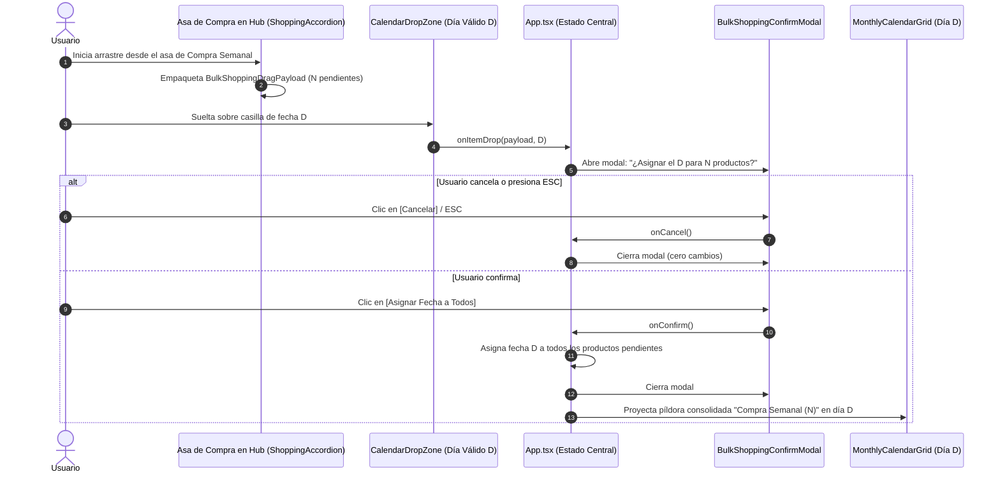

# CENTRA-T · FIA-A07.05 · ARRASTRE MASIVO DE COMPRA AL CALENDARIO (VV-006)

**Proyecto:** Centra-T (Gestor Doméstico Integral y Planificador Temporal)  
**Rebanada Vertical:** RV-A07 · Calendario Mensual Interactivo y Drag & Drop (Cross-Interaction)  
**Estado:** DERIVADA · PENDIENTE DE SPEC, IMPLEMENTACIÓN Y LOCK  
**Hito de Rebanada:** QUINTA UNIDAD DE RV-A07 (ARRASTRE MAESTRO, ASIGNACIÓN EN BLOQUE, AUDITORÍA FORENSE VV-006)  
**Regla de Continuidad:** NO LOCK → NO NEXT  

---

### 1. Identificación
- **FIA:** `FIA-A07.05`
- **Rebanada Vertical:** `RV-A07 · Calendario Mensual Interactivo y Drag & Drop (Cross-Interaction)`
- **Unidad Prevista:** `Arrastre Masivo de Compra al Calendario (VV-006)`
- **PVF de Cierre Cubierta:** `PVF-A07.05 · Asignación Masiva de Lista de Compra al Calendario (VV-006)`
- **VF Interna de Derivación:** `VF-A07.05 · Asignación Masiva de Compra Semanal al Calendario (VV-006)`
- **Objetivo Indexado:** `Habilitar drag handle en cabecera de Compra Semanal. Soltar en casilla invoca POST /shopping/schedule-all asignando todos los pendientes en bloque.`
- **Validación Indexada:** [`src/hub/components/ShoppingAccordion.tsx`](file:///home/hnoloh/Escritorio/Centra-T/src/hub/components/ShoppingAccordion.tsx)
- **Evidencia de Cierre Indexada:** `Superación del caso VV-006: soltar la compra programa todos los productos pendientes en el día seleccionado en una píldora consolidada.`
- **LOCK Previo Requerido:** `LOCK-FIA-A07.04.md APROBADO (FIA-A07.04_AS_BUILT.md)`
- **Estado Documental:** `FIA inicial derivada. No es SPEC, implementación, reporte ni LOCK.`

### 2. Objetivo
Diseñar, implementar y verificar con TDD en Vitest el flujo de interacción cruzada masiva de la Compra Semanal hacia el planificador temporal, satisfaciendo la auditoría forense **VV-006**:
1. **Asa de Arrastre Maestro en la Cabecera de Compra Semanal (`ShoppingAccordion.tsx`):**
   - Incorporar un control de arrastre maestro (`drag handle` con icono accesible `⠿` o equivalente, `data-testid="shopping-bulk-drag-handle"`) en la cabecera del acordeón de compras.
   - Al iniciar el arrastre, empaquetar un payload especial tipado `BulkShoppingDragPayload` en el `dataTransfer` con los productos pendientes de compra (`completado === false && fechaProgramada === null`).
2. **Modal de Confirmación de Asignación Masiva (`BulkShoppingConfirmModal.tsx`):**
   - Al soltar la compra completa sobre una casilla de día válido (`targetDate`):
     - Si no existen productos pendientes sin fecha, cancelar la operación e informar mediante toast/notificación inline (*"No hay productos pendientes sin fecha para programar"*).
     - Si existen productos pendientes, desplegar el modal de confirmación con el recuento exacto: *"¿Asignar el [Fecha Destino] como día de compra para N productos pendientes?"*.
     - Botón secundario `[Cancelar]` (y soporte de tecla `Escape`) para abortar el cambio.
     - Botón primario `[Asignar Fecha a Todos]` para ejecutar la asignación en bloque.
3. **Píldora Consolidada de Compra en el Calendario:**
   - Al confirmar la asignación masiva, todos los productos pendientes adoptan la fecha seleccionada (`fechaProgramada = targetDate`).
   - La casilla correspondiente en el calendario proyecta una píldora consolidada especial de compra (ej. badge `🛒` o `C` con texto *"Compra Semanal (N productos)"* o listado de compras unificadas).
4. **Orquestación en [`App.tsx`](file:///home/hnoloh/Escritorio/Centra-T/src/App.tsx) y Sincronización:**
   - Invocación de `shoppingService.bulkSchedule` (o mutación centralizada equivalente en memoria) y actualización en caliente de todos los productos y del calendario sin recarga de página.

### 3. Alcance
- **IN-SCOPE (Obligatorio en esta FIA):**
  - Contrato de datos `BulkShoppingDragPayload` en [`src/calendar-sync/types/drag-drop.types.ts`](file:///home/hnoloh/Escritorio/Centra-T/src/calendar-sync/types/drag-drop.types.ts).
  - Asa de arrastre maestro (`drag handle`) en la cabecera de [`src/hub/components/ShoppingAccordion.tsx`](file:///home/hnoloh/Escritorio/Centra-T/src/hub/components/ShoppingAccordion.tsx) y estilos en [`ShoppingAccordion.module.css`](file:///home/hnoloh/Escritorio/Centra-T/src/hub/components/ShoppingAccordion.module.css).
  - Componente modal [`src/calendar-sync/components/BulkShoppingConfirmModal.tsx`](file:///home/hnoloh/Escritorio/Centra-T/src/calendar-sync/components/BulkShoppingConfirmModal.tsx) y estilos [`BulkShoppingConfirmModal.module.css`](file:///home/hnoloh/Escritorio/Centra-T/src/calendar-sync/components/BulkShoppingConfirmModal.module.css).
  - Soporte en [`src/calendar-sync/components/CalendarTaskPill.tsx`](file:///home/hnoloh/Escritorio/Centra-T/src/calendar-sync/components/CalendarTaskPill.tsx) (o píldora consolidada) para representar la compra semanal agrupada.
  - Orquestación en [`src/App.tsx`](file:///home/hnoloh/Escritorio/Centra-T/src/App.tsx) para interceptar el soltado masivo de compras.
  - Suites de pruebas unitarias (`BulkShoppingConfirmModal.test.tsx`, `ShoppingAccordion.test.tsx`) y prueba de integración E2E en [`src/App.test.tsx`](file:///home/hnoloh/Escritorio/Centra-T/src/App.test.tsx) validando el escenario forense **VV-006**.
- **OUT-OF-SCOPE (Estrictamente prohibido en esta FIA y reservado a la siguiente):**
  - Menú contextual de clic derecho en la píldora del calendario para desasignar la fecha (Caso `VV-007`, reservado taxativamente para `FIA-A07.06`).

### 4. Dependencias
- **Documentales:**
  - `SUITE_ARQUITECTURA_CORE.docx` (Doc 05: Module Map - Subsistema `shopping` y `calendar_sync`).
  - `SUITE_ARQUITECTURA_UI.docx` (Doc 07: Feature 08 - Arrastre Masivo de Compra; Doc 10: Validación Forense QA - Caso VV-006).
  - `Centra-T Pseudocódigo (unificado).odt` (Módulo 6: calendar_sync - Proceso `Arrastre_Masivo_Compra_Semanal`).
  - `CENTRA-T_INDICE_RV_FIA.docx` (Fila FIA-A07.05).
  - `CENTRA-T_INDICE_PVF_VF.docx` (PVF-A07.05 y VF-A07.05).
  - `FIA-A07.04_AS_BUILT.md` (Cierre y sellado formal de la intercepción modal de conflicto).
- **Tecnológicas Autorizadas:**
  - React 19.0.0, ReactDOM 19.0.0, TypeScript 5.7.3 estricto, CSS Modules puros con `tokens.css`, Vitest 3.2.7 y Testing Library.
- **Dependencia Secuencial (NO LOCK → NO NEXT):**
  - *Previa:* Requiere el LOCK formal de `FIA-A07.04` (Sellado y consolidado con 318 tests en verde).
  - *Posterior:* La unidad `FIA-A07.06` (Desasignación por Clic Derecho - VV-007) no podrá iniciarse hasta la aprobación formal y LOCK de esta FIA.

### 5. Contratos Afectados
- **Contrato Funcional (`PVF-A07.05` / `VF-A07.05` / Caso VV-006):**
  - Arrastrar el asa de la cabecera de Compra Semanal hacia el calendario transporta el lote de compras pendientes.
  - Soltar sobre casilla de fecha válida despliega modal de confirmación masiva especificando el número de productos pendientes.
  - Confirmar ejecuta la programación en bloque de todos los productos y materializa una píldora consolidada en el calendario.
- **Contrato de Dominio / Datos:**
  ```typescript
  export interface BulkShoppingDragPayload {
    id: 'bulk-shopping';
    modulo: 'shopping';
    titulo: string;
    isBulk: true;
    pendingCount: number;
  }
  ```

### 6. Restricciones
- Prohibido modificar productos que ya se encontraban completados (`completado === true`); la asignación masiva afecta exclusivamente a productos pendientes sin fecha previa (`completado === false && fechaProgramada === null`).
- Prohibido soltar la compra en fechas pasadas: la regla de la Decisión 1A (`FIA-A07.03`) bloquea de forma incondicional el drop con cursor `not-allowed`.
- Cero librerías externas adicionales.

### 7. Diseño Técnico
- **Asa de Arrastre Maestro en `ShoppingAccordion.tsx`:**
  - Elemento draggable situado en la cabecera del acordeón (`aria-grabbed`, `draggable={pendingCount > 0}`, `title="Arrastrar compra semanal al calendario"`).
  - Manejador `onDragStart` que construye `BulkShoppingDragPayload` con los productos pendientes.
- **Modal `BulkShoppingConfirmModal.tsx`:**
  - Modal accesible (`role="dialog"`, `aria-modal="true"`) con título *"Programar Compra Semanal"* y botones `[Cancelar]` y `[Asignar Fecha a Todos]`.
- **Orquestación en `App.tsx`:**
  - Detección de `payload.isBulk === true` en `handleScheduleItem`.
  - Despliegue de `BulkShoppingConfirmModal`.
  - Invocación de actualización masiva en la lista de compras y consolidación en el calendario.

### 8. Flujo Operativo


### 9. Casos Válidos (Happy Path & Escenarios Permitidos)
- **Caso 1 (Arrastre y Despliegue de Modal):** Arrastrar el asa de compras con N productos pendientes y soltar en una casilla válida abre el modal indicando N productos.
- **Caso 2 (Cancelación de Asignación Masiva):** Pulsar `[Cancelar]` o la tecla `Escape` descarta la asignación masiva sin alterar ningún producto.
- **Caso 3 (Confirmación y Píldora Consolidada):** Pulsar `[Asignar Fecha a Todos]` asigna la fecha a todos los productos pendientes y proyecta la píldora consolidada en el calendario.
- **Caso 4 (Bloqueo en Fecha Pasada):** Arrastrar sobre un día pasado muestra cursor `not-allowed` y rechaza el soltado (Decisión 1A).

### 10. Casos Inválidos (Manejo de Excepciones y Rechazos)
- **Caso Inválido 1 (Sin Productos Pendientes):** Si la lista no tiene productos pendientes sin fecha (`pendingCount === 0`), el asa de arrastre no inicia operación o muestra aviso informativo.
- **Causas de Rechazo Automático:**
  - Asignación masiva en fechas pasadas.
  - Modificación de productos ya marcados como completados.
  - Regresiones en las 37 suites existentes.

### 11. Tests Requeridos
- **Suite Modal Masivo (`BulkShoppingConfirmModal.test.tsx`):**
  - Renderizado condicional con número de productos y fecha.
  - Botones de confirmación y cancelación.
  - Soporte de tecla `Escape`.
- **Suite Acordeón Compra (`ShoppingAccordion.test.tsx`):**
  - Presencia del asa de arrastre maestro y serialización de `BulkShoppingDragPayload`.
- **Suite E2E en App (`App.test.tsx`):**
  - Validación forense integral del caso **`[VV-006]`**:
    1. Arrastre de compra masiva al calendario.
    2. Apertura del modal con N productos pendientes.
    3. Confirmación asigna la fecha a todos y renderiza la píldora consolidada en la casilla.
- **Evidencia Exigida:** 100% de tests en verde (mínimo 330+ tests totales en 38 suites).

### 12. Quality Gates (QG-FIA-A07.05)
- `QG-FIA-A07.05-01 · Compilación y Tipado:` `tsc --noEmit` superado con 0 errores.
- `QG-FIA-A07.05-02 · Tests Unitarios e Integración:` 100% de tests en verde sin regresiones.
- `QG-FIA-A07.05-03 · Anti-Scope Creep:` Cero código de desasignación por clic derecho (VV-007).
- `QG-FIA-A07.05-04 · Verificación Funcional UI:` Superación demostrada del caso forense `VV-006`.

### 13. Definition of Done (DoD)
La unidad se considerará completada y lista para LOCK si y solo si:
1. `ShoppingAccordion.tsx` expone el asa de arrastre maestro con `BulkShoppingDragPayload`.
2. `BulkShoppingConfirmModal.tsx` está implementado, estilizado y verificado con tests.
3. Se supera de forma demostrable la auditoría del caso forense `VV-006`.
4. Los 4 Quality Gates están superados con 100% de tests en verde.
5. Se emiten el `IMPLEMENTATION_REPORT_FIA-A07.05.md` y `TEST_REPORT_FIA-A07.05.md`.
