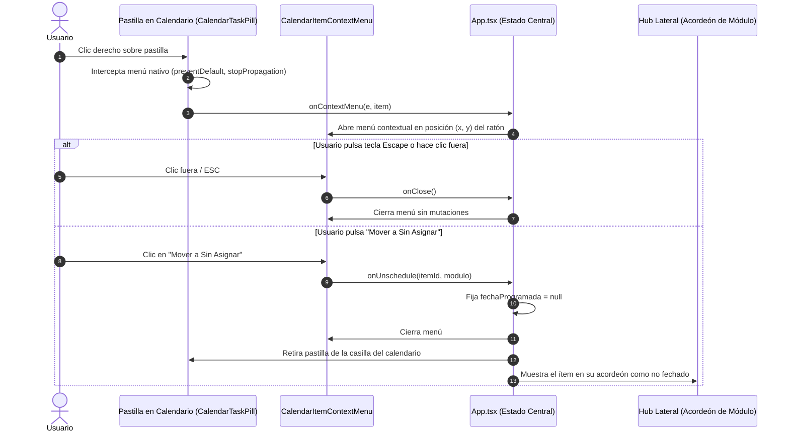

# CENTRA-T · FIA-A07.06 · DESASIGNACIÓN POR CLIC DERECHO Y RETORNO AL HUB (VV-007)

**Proyecto:** Centra-T (Gestor Doméstico Integral y Planificador Temporal)  
**Rebanada Vertical:** RV-A07 · Calendario Mensual Interactivo y Drag & Drop (Cross-Interaction)  
**Estado:** DERIVADA · PENDIENTE DE SPEC, IMPLEMENTACIÓN Y LOCK  
**Hito de Rebanada:** SEXTA Y ÚLTIMA UNIDAD DE RV-A07 (CIERRE TOTAL DE LA REBANADA VERTICAL RV-A07)  
**Regla de Continuidad:** NO LOCK → NO NEXT  

---

### 1. Identificación
- **FIA:** `FIA-A07.06`
- **Rebanada Vertical:** `RV-A07 · Calendario Mensual Interactivo y Drag & Drop (Cross-Interaction)`
- **Unidad Prevista:** `Desasignación por Clic Derecho y Retorno al Hub (VV-007)`
- **PVF de Cierre Cubierta:** `PVF-A07.06 · Desasignación Rápida de Fecha y Retorno al Hub (VV-007)`
- **VF Interna de Derivación:** `VF-A07.06 · Desasignación de Fecha y Retorno al Hub (VV-007)`
- **Objetivo Indexado:** `Menú contextual accesible en cada píldora del calendario con opción 'Mover a Sin Asignar' (PATCH /items/:id/unschedule).`
- **Validación Indexada:** [`src/calendar-sync/components/CalendarItemContextMenu.tsx`](file:///home/hnoloh/Escritorio/Centra-T/src/calendar-sync/components/CalendarItemContextMenu.tsx)
- **Evidencia de Cierre Indexada:** `Superación del caso VV-007: clic en la opción retira la píldora del calendario y la devuelve al Hub como ítem no fechado.`
- **LOCK Previo Requerido:** `LOCK-FIA-A07.05.md APROBADO (FIA-A07.05_AS_BUILT.md)`
- **Estado Documental:** `FIA inicial derivada. No es SPEC, implementación, reporte ni LOCK.`

### 2. Objetivo
Diseñar, implementar y verificar con TDD en Vitest el menú contextual accesible para las pastillas del calendario y el mecanismo de desvinculación temporal no destructiva, cerrando definitivamente la rebanada vertical **RV-A07** y satisfaciendo la auditoría forense **VV-007**:
1. **Intercepción de Clic Derecho en Pastillas ([`CalendarTaskPill.tsx`](file:///home/hnoloh/Escritorio/Centra-T/src/calendar-sync/components/CalendarTaskPill.tsx)):**
   - Manejador de evento `onContextMenu` que intercepta el menú contextual predeterminado del navegador (`e.preventDefault()`, `e.stopPropagation()`).
   - Emisión del evento de apertura del menú contextual suministrando las coordenadas del cursor `(x, y)` y la identificación del ítem (`id`, `modulo`, `titulo`).
2. **Componente de Menú Contextual Accesible ([`CalendarItemContextMenu.tsx`](file:///home/hnoloh/Escritorio/Centra-T/src/calendar-sync/components/CalendarItemContextMenu.tsx)):**
   - Popover flotante posicionado con `fixed` en las coordenadas del cursor (`z-index: 1050`).
   - WAI-ARIA completo: `role="menu"`, items con `role="menuitem"`, soporte de navegación por teclado y cierre inmediato con tecla `Escape` o clic fuera del menú.
   - Opción canónica destacada: `"Mover a Sin Asignar"` (con icono sutil o distintivo de desprogramación).
3. **Flujo de Desasignación Temporal No Destructiva (Unschedule):**
   - Al pulsar `"Mover a Sin Asignar"`, se invoca la desasignación de fecha (`fechaProgramada = null`).
   - La pastilla desaparece inmediatamente de la casilla del calendario.
   - **Cero eliminación destructiva:** el ítem permanece 100% íntegro en la base de datos y se muestra en su respectivo acordeón del Hub (`TasksAccordion`, `ShoppingAccordion`, `CleaningAccordion`) como ítem pendiente sin fecha asignada.
4. **Cierre y Sellado Definitivo de RV-A07:**
   - La culminación de esta unidad sella la rebanada vertical completa: cuadrícula mensual, Drag & Drop nativo, bloqueo de fechas pasadas (Decisión 1A / VV-002), modal de conflicto de reasignación (Decisión 4B / VV-003), arrastre masivo de compras (VV-006) y desasignación por clic derecho (VV-007).

### 3. Alcance
- **IN-SCOPE (Obligatorio en esta FIA):**
  - Componente [`src/calendar-sync/components/CalendarItemContextMenu.tsx`](file:///home/hnoloh/Escritorio/Centra-T/src/calendar-sync/components/CalendarItemContextMenu.tsx) y estilos [`CalendarItemContextMenu.module.css`](file:///home/hnoloh/Escritorio/Centra-T/src/calendar-sync/components/CalendarItemContextMenu.module.css).
  - Suite de pruebas unitarias [`CalendarItemContextMenu.test.tsx`](file:///home/hnoloh/Escritorio/Centra-T/src/calendar-sync/components/CalendarItemContextMenu.test.tsx).
  - Manejador `onContextMenu` en [`CalendarTaskPill.tsx`](file:///home/hnoloh/Escritorio/Centra-T/src/calendar-sync/components/CalendarTaskPill.tsx) y pruebas asociadas en `CalendarTaskPill.test.tsx`.
  - Propagación y montaje del menú en [`MonthlyCalendarGrid.tsx`](file:///home/hnoloh/Escritorio/Centra-T/src/workspace/components/MonthlyCalendarGrid.tsx) o [`App.tsx`](file:///home/hnoloh/Escritorio/Centra-T/src/App.tsx).
  - Manejador `handleUnscheduleItem` en [`src/App.tsx`](file:///home/hnoloh/Escritorio/Centra-T/src/App.tsx) que desvincula la fecha del ítem (`fechaProgramada: null`) y actualiza el estado reactivamente.
  - Pruebas de integración E2E en [`src/App.test.tsx`](file:///home/hnoloh/Escritorio/Centra-T/src/App.test.tsx) validando el escenario forense **VV-007**.
- **OUT-OF-SCOPE (Estrictamente prohibido en esta FIA):**
  - Eliminación física del ítem de la base de datos (se debe usar unschedule, nunca delete).
  - Capacidades asignadas a la siguiente Rebanada Vertical `RV-A08`.

### 4. Dependencias
- **Documentales:**
  - `SUITE_ARQUITECTURA_CORE.docx` (Doc 05: Module Map - Subsistema `calendar_sync`).
  - `SUITE_ARQUITECTURA_UI.docx` (Doc 07: Feature 08 - Desasignación sin Eliminación; Doc 08: Estilos Visuales; Doc 10: Validación Forense QA - Caso VV-007).
  - `Centra-T Pseudocódigo (unificado).odt` (Módulo 6: calendar_sync - Proceso `Desasignar_Fecha_Desde_Calendario`).
  - `CENTRA-T_INDICE_RV_FIA.docx` (Fila FIA-A07.06).
  - `CENTRA-T_INDICE_PVF_VF.docx` (PVF-A07.06 y VF-A07.06).
  - `FIA-A07.05_AS_BUILT.md` (Cierre formal del arrastre masivo de compras).
- **Tecnológicas Autorizadas:**
  - React 19.0.0, ReactDOM 19.0.0, TypeScript 5.7.3 estricto, CSS Modules puros con `tokens.css`, Vitest 3.2.7 y Testing Library.
- **Dependencia Secuencial (NO LOCK → NO NEXT):**
  - *Previa:* Requiere el LOCK formal de `FIA-A07.05` (Sellado y consolidado con 332 tests en verde).
  - *Posterior:* El cierre de esta unidad desbloquea la transición formal hacia la rebanada vertical sucesiva `RV-A08`.

### 5. Contratos Afectados
- **Contrato Funcional (`PVF-A07.06` / `VF-A07.06` / Caso VV-007):**
  - Clic derecho sobre una pastilla de tarea en el calendario despliega un menú contextual accesible.
  - Al seleccionar `"Mover a Sin Asignar"`, el ítem ve retirada su fecha (`fechaProgramada = null`), desaparece del calendario y reaparece intacto en el Hub como ítem no fechado.
  - Cero efectos colaterales destructivos.
- **Contrato de Interfaz Visual:**
  - Menú popover flotante con posición absoluta/fija `(x, y)` (`z-index: 1050`), fondo `--bg-card` (`#1A2433`), borde `--border-subtle` (`#233144`), radio de 8px y sombra sutil.

### 6. Restricciones
- Prohibido borrar el elemento de la base de datos o de la memoria; únicamente se desvincula `fechaProgramada` a `null`.
- Prohibido dejar el menú contextual abierto al hacer clic fuera o al presionar `Escape`.
- Cero librerías externas de menús contextuales.

### 7. Diseño Técnico
- **Componente [`CalendarItemContextMenu.tsx`](file:///home/hnoloh/Escritorio/Centra-T/src/calendar-sync/components/CalendarItemContextMenu.tsx):**
  - Props:
    ```typescript
    export interface CalendarItemContextMenuProps {
      isOpen: boolean;
      position: { x: number; y: number };
      itemId: string;
      modulo: ItemModule;
      itemTitle: string;
      onUnschedule: (itemId: string, modulo: ItemModule) => void;
      onClose: () => void;
    }
    ```
- **Evento en [`CalendarTaskPill.tsx`](file:///home/hnoloh/Escritorio/Centra-T/src/calendar-sync/components/CalendarTaskPill.tsx):**
  - Callback `onContextMenu?: (e: React.MouseEvent, item: { id: string; modulo: ItemModule; titulo: string }) => void`.
- **Orquestación en [`App.tsx`](file:///home/hnoloh/Escritorio/Centra-T/src/App.tsx):**
  - Estado `contextMenuState: { position: { x: number; y: number }; item: { id: string; modulo: ItemModule; titulo: string } } | null`.
  - Manejador `handleUnscheduleItem(itemId: string, modulo: ItemModule)`:
    - Para `tasks`: `setAllTasks(prev => prev.map(t => t.id === itemId ? { ...t, fechaProgramada: null } : t))`.
    - Para `shopping`: `setAllShopping(prev => prev.map(s => s.id === itemId ? { ...s, fechaProgramada: null } : s))`.
    - Para `cleaning`: `setAllCleaning(prev => prev.map(c => c.id === itemId ? { ...c, fechaProgramada: null } : c))`.

### 8. Flujo Operativo


### 9. Casos Válidos (Happy Path & Escenarios Permitidos)
- **Caso 1 (Apertura de Menú Contextual):** Clic derecho sobre una pastilla despliega el menú en las coordenadas del cursor.
- **Caso 2 (Desasignación Exitosa - VV-007):** Clic en `"Mover a Sin Asignar"` retira la pastilla del calendario y mantiene el ítem en el Hub sin fecha.
- **Caso 3 (Cierre Inofensivo con Escape):** Tecla `Escape` cierra el menú sin alterar la asignación.
- **Caso 4 (Cierre al Hacer Clic Fuera):** Clic en cualquier área fuera del menú lo cierra.

### 10. Casos Inválidos (Manejo de Excepciones y Rechazos)
- **Caso Inválido 1 (Eliminación Accidental):** La acción bajo ninguna circunstancia debe invocar `deleteTask`, `deleteItem` o eliminar el registro de la colección.
- **Causas de Rechazo Automático:**
  - Pérdida o borrado de datos del ítem al desasignar.
  - Falla en el cierre del menú con Escape.
  - Regresiones en las 38 suites existentes.

### 11. Tests Requeridos
- **Suite Menú Contextual (`CalendarItemContextMenu.test.tsx`):**
  - Renderizado condicional si `isOpen === true` en coordenadas `(x, y)`.
  - Opción `"Mover a Sin Asignar"` con `role="menuitem"`.
  - Invocación de `onUnschedule` al pulsar la opción.
  - Invocación de `onClose` al presionar `Escape` o hacer clic fuera.
- **Suite Pastillas (`CalendarTaskPill.test.tsx`):**
  - Disparo de `onContextMenu` al recibir clic derecho con las coordenadas y datos del ítem.
- **Suite E2E en App (`App.test.tsx`):**
  - Validación forense integral del caso **`[VV-007]`**:
    1. Clic derecho sobre una pastilla en el calendario.
    2. Menú desplegado con la opción "Mover a Sin Asignar".
    3. Clic en la opción retira la pastilla de la casilla.
    4. El ítem permanece intacto en el Hub sin fecha asignada.
- **Evidencia Exigida:** 100% de tests en verde (mínimo 345+ tests totales en 39 suites).

### 12. Quality Gates (QG-FIA-A07.06)
- `QG-FIA-A07.06-01 · Compilación y Tipado:` `tsc --noEmit` superado con 0 errores.
- `QG-FIA-A07.06-02 · Tests Unitarios e Integración:` 100% de tests en verde sin regresiones.
- `QG-FIA-A07.06-03 · Anti-Scope Creep:` Cero código de borrado destructivo.
- `QG-FIA-A07.06-04 · Verificación Funcional UI:` Superación demostrada del caso forense `VV-007`.

### 13. Definition of Done (DoD)
La unidad se considerará completada y lista para LOCK si y solo si:
1. `CalendarItemContextMenu.tsx` está implementado, estilizado y probado.
2. `CalendarTaskPill.tsx` intercepta clic derecho y comunica el evento.
3. `App.tsx` procesa la desasignación sin eliminar el ítem.
4. Se supera de forma demostrable la auditoría del caso forense `VV-007`.
5. Los 4 Quality Gates están superados con 100% de tests en verde.
6. Se emiten el `IMPLEMENTATION_REPORT_FIA-A07.06.md`, `TEST_REPORT_FIA-A07.06.md` y el certificado de cierre total de la rebanada vertical `LOCK-FIA-A07.06.md`.
