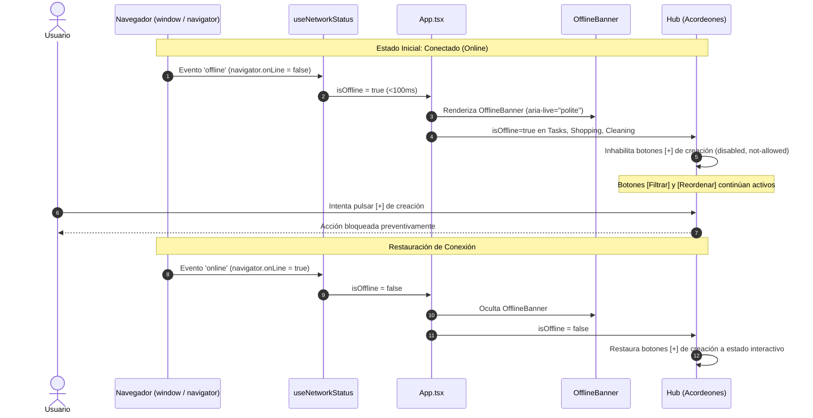

# CENTRA-T · FIA-A08.01 · DETECCIÓN OFFLINE Y BANNER PREVENTIVO (VV-008)

**Proyecto:** Centra-T (Gestor Doméstico Integral y Planificador Temporal)  
**Rebanada Vertical:** RV-A08 · Resiliencia Offline, Manejo de Errores y Cierre Forense (Resilience & QA)  
**Estado:** DERIVADA · PENDIENTE DE SPEC, IMPLEMENTACIÓN Y LOCK  
**Hito de Rebanada:** PRIMERA UNIDAD DE RV-A08 (APERTURA FORMAL DE LA REBANADA VERTICAL RV-A08)  
**Regla de Continuidad:** NO LOCK → NO NEXT  

---

### 1. Identificación
- **FIA:** `FIA-A08.01`
- **Rebanada Vertical:** `RV-A08 · Resiliencia Offline, Manejo de Errores y Cierre Forense (Resilience & QA)`
- **Unidad Prevista:** `Detección Offline y Banner Preventivo (VV-008)`
- **PVF de Cierre Cubierta:** `PVF-A08.01 · Detección de Desconexión y Modo Preventivo Solo Lectura (VV-008)`
- **VF Interna de Derivación:** `VF-A08.01 · Modo Preventivo Offline y Congelación de Mutaciones (VV-008)`
- **Objetivo Indexado:** `Implementar detector global de red (navigator.onLine). Desconexión despliega banner superior en <100ms y congela mutaciones destructivas.`
- **Validación Indexada:** [`src/workspace/components/OfflineBanner.tsx`](file:///home/hnoloh/Escritorio/Centra-T/src/workspace/components/OfflineBanner.tsx)
- **Evidencia de Cierre Indexada:** `Superación del caso VV-008: caída de red activa modo solo lectura y deshabilita botones de creación/eliminación; reconexión restaura operatividad.`
- **LOCK Previo Requerido:** `LOCK-FIA-A07.06.md APROBADO (FIA-A07.06_AS_BUILT.md)`
- **Estado Documental:** `FIA inicial derivada. No es SPEC, implementación, reporte ni LOCK.`

### 2. Objetivo
Diseñar, implementar y verificar con TDD en Vitest el sistema de detección reactiva del estado de red (`navigator.onLine`, eventos `offline`/`online`), la proyección inmediata de un banner de advertencia superior accesible y la congelación preventiva de mutaciones en modo solo lectura, abriendo la rebanada vertical **RV-A08** y satisfaciendo la auditoría forense **VV-008**:
1. **Detección Reactiva del Estado de Conexión (`useNetworkStatus`):**
   - Hook o manejador de red que sincroniza el estado `isOffline` mediante `navigator.onLine` y escucha eventos nativos `window.addEventListener('offline')` y `window.addEventListener('online')`.
   - Latencia de respuesta ultra-baja (<100ms) ante la caída o restauración de red.
2. **Componente de Banner Superior Preventivo ([`OfflineBanner.tsx`](file:///home/hnoloh/Escritorio/Centra-T/src/workspace/components/OfflineBanner.tsx)):**
   - Banner visible en la parte superior del workspace con `role="status"` o `role="alert"`, semántica WAI-ARIA (`aria-live="polite"`).
   - Microcopy canónico: *"Modo sin conexión: la aplicación está en modo solo lectura. Las modificaciones y creaciones están deshabilitadas hasta restablecer la red."*
   - Estilizado sobrio con tokens ámbar de advertencia (`--accent-amber` / `#F59E0B`), micro-animación de entrada sin causar Cumulative Layout Shift (CLS = 0).
3. **Modo Solo Lectura y Congelación de Mutaciones (Caso VV-008):**
   - Deshabilitación visual y funcional de los botones de creación `[+]` en los acordeones del Hub (`TasksAccordion`, `ShoppingAccordion`, `CleaningAccordion`).
   - Bloqueo de acciones de eliminación y drag & drop hacia el calendario mientras se esté desconectado.
   - **Garantía de Consulta Local:** Los botones de `[Filtrar]` y `[Reordenar]` en el Hub permanecen 100% operativos, permitiendo consultar, ordenar y explorar los datos ya cargados en memoria.
4. **Restauración Automática al Reconectar:**
   - La recuperación de la conectividad (`window.dispatchEvent(new Event('online'))`) oculta automáticamente el banner y devuelve la plena interactividad a los botones de creación y mutación.

### 3. Alcance
- **IN-SCOPE (Obligatorio en esta FIA):**
  - Componente [`src/workspace/components/OfflineBanner.tsx`](file:///home/hnoloh/Escritorio/Centra-T/src/workspace/components/OfflineBanner.tsx) y estilos [`OfflineBanner.module.css`](file:///home/hnoloh/Escritorio/Centra-T/src/workspace/components/OfflineBanner.module.css).
  - Hook [`src/workspace/hooks/useNetworkStatus.ts`](file:///home/hnoloh/Escritorio/Centra-T/src/workspace/hooks/useNetworkStatus.ts) (o gestión equivalente en el workspace) con pruebas unitarias.
  - Integración en [`src/workspace/components/WorkspaceLayout.tsx`](file:///home/hnoloh/Escritorio/Centra-T/src/workspace/components/WorkspaceLayout.tsx) y [`src/App.tsx`](file:///home/hnoloh/Escritorio/Centra-T/src/App.tsx).
  - Inhabilitación de los botones de creación `[+]` en [`TasksAccordion.tsx`](file:///home/hnoloh/Escritorio/Centra-T/src/hub/components/TasksAccordion.tsx), [`ShoppingAccordion.tsx`](file:///home/hnoloh/Escritorio/Centra-T/src/hub/components/ShoppingAccordion.tsx) y [`CleaningAccordion.tsx`](file:///home/hnoloh/Escritorio/Centra-T/src/hub/components/CleaningAccordion.tsx) mediante prop `isOffline`.
  - Mantenimiento activo de `[Filtrar]` y `[Reordenar]`.
  - Pruebas de integración E2E en [`src/App.test.tsx`](file:///home/hnoloh/Escritorio/Centra-T/src/App.test.tsx) certificando el caso forense **`[VV-008]`**.
- **OUT-OF-SCOPE (Estrictamente prohibido en esta FIA):**
  - Interceptor HTTP de errores 5xx/4xx y Toast empático con rollback (reservado a `FIA-A08.02`).
  - Suite de Playwright E2E y telemetría de CI (reservado a `FIA-A08.03`).
  - Service Workers avanzados o almacenamiento offline IndexedDB (fuera del alcance arquitectónico acordado).

### 4. Dependencias
- **Documentales:**
  - `SUITE_ARQUITECTURA_CORE.docx` (Doc 05: Module Map).
  - `SUITE_ARQUITECTURA_UI.docx` (Doc 07: Feature 09 - Resiliencia y Detección de Red; Doc 08: Estilos Visuales; Doc 10: Validación Forense QA - Caso VV-008; Invariante 3: Protocolo Preventivo de Desconexión).
  - `Centra-T Pseudocódigo (unificado).odt`.
  - `CENTRA-T_INDICE_RV_FIA.docx` (Fila FIA-A08.01).
  - `CENTRA-T_INDICE_PVF_VF.docx` (PVF-A08.01 y VF-A08.01).
  - `FIA-A07.06_AS_BUILT.md` (Cierre formal de RV-A07).
- **Tecnológicas Autorizadas:**
  - React 19.0.0, ReactDOM 19.0.0, TypeScript 5.7.3 estricto, CSS Modules puros con `tokens.css`, Vitest 3.2.7 y Testing Library.
- **Dependencia Secuencial (NO LOCK → NO NEXT):**
  - *Previa:* Requiere el LOCK formal de `FIA-A07.06` (Sellado y consolidado con 343 tests en verde).
  - *Posterior:* El cierre de esta unidad desbloquea la transición formal hacia `FIA-A08.02` (Interceptor de Errores Empáticos y Rollback Toast).

### 5. Contratos Afectados
- **Contrato Funcional (`PVF-A08.01` / `VF-A08.01` / Caso VV-008):**
  - Desconexión (`navigator.onLine = false` o evento `offline`) proyecta `OfflineBanner` en <100ms.
  - Los botones de creación `[+]` pasan a estado disabled (`aria-disabled="true"`, `disabled`, opacidad reducida y cursor `not-allowed`).
  - Los controles de consulta local (`Filtrar`, `Reordenar`) permanecen habilitados.
  - Reconexión (`online`) retira el banner y restaura los botones inmediatamente.
- **Contrato de Interfaz Visual:**
  - Banner superior no modal: fondo ámbar oscuro (`rgba(245, 158, 11, 0.15)` o `#2D2310`), borde de 1px en `#F59E0B66`, texto `--text-primary` con acento ámbar, icono `⚠️` y tipografía de 13px.
  - Cero Cumulative Layout Shift (CLS = 0).

### 6. Restricciones
- Prohibido el uso de librerías externas de detección de red o notificación.
- Prohibido bloquear la lectura o consulta de los datos ya existentes en memoria: la aplicación debe permanecer explorable.
- Prohibido adelantar la lógica de intercepción de errores HTTP o Toast de rollback (reservado a `FIA-A08.02`).

### 7. Diseño Técnico
- **Hook `useNetworkStatus` ([`src/workspace/hooks/useNetworkStatus.ts`](file:///home/hnoloh/Escritorio/Centra-T/src/workspace/hooks/useNetworkStatus.ts)):**
  ```typescript
  export function useNetworkStatus(initialOnline = true): { isOnline: boolean; isOffline: boolean }
  ```
- **Componente [`OfflineBanner.tsx`](file:///home/hnoloh/Escritorio/Centra-T/src/workspace/components/OfflineBanner.tsx):**
  ```typescript
  export interface OfflineBannerProps {
    isOffline: boolean;
    message?: string;
  }
  ```
- **Propagación en Acordeones (`TasksAccordion`, `ShoppingAccordion`, `CleaningAccordion`):**
  - Prop opcional `isOffline?: boolean`.
  - Botón `[+]` condicionado con `disabled={isOffline}` y clase `.newButtonDisabled`.
- **Orquestación en [`App.tsx`](file:///home/hnoloh/Escritorio/Centra-T/src/App.tsx):**
  - Conexión del hook `useNetworkStatus` y renderizado de `OfflineBanner`.
  - Paso de `isOffline` hacia los acordeones del Hub.

### 8. Flujo Operativo


### 9. Casos Válidos (Happy Path & Escenarios Permitidos)
- **Caso 1 (Detección de Caída de Red):** Disparo de evento `offline` despliega el banner ámbar en <100ms.
- **Caso 2 (Congelación Preventiva - VV-008):** En estado offline, los botones de creación `[+]` quedan inhabilitados y no abren el wizard de creación.
- **Caso 3 (Consulta Local Habilitada - VV-008):** En estado offline, los botones `[Filtrar]` y `[Reordenar]` permanecen interactivos.
- **Caso 4 (Reconexión Instantánea):** Disparo de evento `online` retira el banner y rehabilita los botones de creación.

### 10. Casos Inválidos (Manejo de Excepciones y Rechazos)
- **Caso Inválido 1 (Pérdida de Datos en Desconexión):** La conmutación a offline no debe purgar los arrays de tareas, compras o limpiezas cargados.
- **Causas de Rechazo Automático:**
  - Fallo en el despliegue del banner ante evento `offline`.
  - Botones de creación permanecen interactivos mientras se está desconectado.
  - Botones de filtro u ordenación bloqueados innecesariamente en modo offline.
  - Regresiones en las 39 suites existentes.

### 11. Tests Requeridos
- **Suite Hook / Detector (`useNetworkStatus.test.ts`):**
  - Devuelve `isOffline: false` por defecto.
  - Conmuta a `isOffline: true` al disparar `window.dispatchEvent(new Event('offline'))`.
  - Conmuta a `isOffline: false` al disparar `window.dispatchEvent(new Event('online'))`.
- **Suite Banner (`OfflineBanner.test.tsx`):**
  - Renderiza texto de advertencia con `role="status"` o `role="alert"` si `isOffline === true`.
  - No renderiza nada en el DOM si `isOffline === false`.
- **Suite Acordeones (`TasksAccordion.test.tsx`, `ShoppingAccordion.test.tsx`, `CleaningAccordion.test.tsx`):**
  - El botón `[+]` tiene atributo `disabled` cuando `isOffline === true`.
- **Suite E2E en App (`App.test.tsx`):**
  - Validación forense integral del caso **`[VV-008]`**:
    1. Simular corte de red (`offline`).
    2. Verificar presencia del banner superior `OfflineBanner`.
    3. Verificar que los botones `[+]` de creación están inhabilitados.
    4. Verificar que `[Filtrar]` y `[Reordenar]` siguen funcionando.
    5. Simular restablecimiento de red (`online`).
    6. Verificar desaparición del banner y reanudación de los botones de creación.
- **Evidencia Exigida:** 100% de tests en verde (mínimo 355+ tests totales en 41 suites).

### 12. Quality Gates (QG-FIA-A08.01)
- `QG-FIA-A08.01-01 · Compilación y Tipado:` `tsc --noEmit` superado con 0 errores.
- `QG-FIA-A08.01-02 · Tests Unitarios e Integración:` 100% de tests en verde sin regresiones.
- `QG-FIA-A08.01-03 · Anti-Scope Creep:` Cero código de interceptores HTTP o rollback Toast (reservado a `FIA-A08.02`).
- `QG-FIA-A08.01-04 · Verificación Funcional UI:` Superación demostrada del caso forense `VV-008`.

### 13. Definition of Done (DoD)
La unidad se considerará completada y lista para LOCK si y solo si:
1. `OfflineBanner.tsx` y su módulo CSS están implementados y verificados.
2. La detección de conectividad (`useNetworkStatus`) reacciona a eventos del navegador.
3. Los botones de creación se inhabilitan en modo offline, manteniendo activos los filtros y ordenaciones.
4. Se supera de forma demostrable la auditoría del caso forense `VV-008`.
5. Los Quality Gates están superados con 100% de tests en verde.
6. Se emiten el `IMPLEMENTATION_REPORT_FIA-A08.01.md`, `TEST_REPORT_FIA-A08.01.md` y `LOCK-FIA-A08.01.md`.
