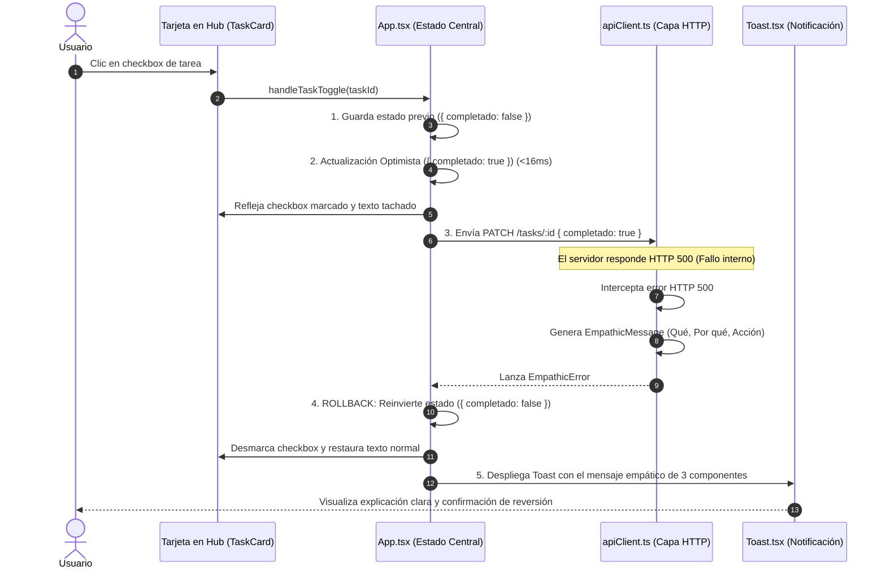

# CENTRA-T · FIA-A08.02 · INTERCEPTOR ERRORES EMPÁTICOS Y ROLLBACK TOAST

**Proyecto:** Centra-T (Gestor Doméstico Integral y Planificador Temporal)  
**Rebanada Vertical:** RV-A08 · Resiliencia Offline, Manejo de Errores y Cierre Forense (Resilience & QA)  
**Estado:** DERIVADA · PENDIENTE DE SPEC, IMPLEMENTACIÓN Y LOCK  
**Hito de Rebanada:** SEGUNDA UNIDAD DE RV-A08 (MANEJO EMPÁTICO DE ERRORES, CAPA HTTP Y REVERSIÓN OPTIMISTA)  
**Regla de Continuidad:** NO LOCK → NO NEXT  

---

### 1. Identificación
- **FIA:** `FIA-A08.02`
- **Rebanada Vertical:** `RV-A08 · Resiliencia Offline, Manejo de Errores y Cierre Forense (Resilience & QA)`
- **Unidad Prevista:** `Interceptor Errores Empáticos y Rollback Toast`
- **PVF de Cierre Cubierta:** `PVF-A08.02 · Interceptor de Errores Constructivos y Garantía de Rollback`
- **VF Interna de Derivación:** `VF-A08.02 · Errores Constructivos y Reversión de Estado Optimista`
- **Objetivo Indexado:** `Capa HTTP cliente con interceptor de errores que traduce códigos en mensajes empáticos de 3 componentes y ejecuta rollback de UI optimista.`
- **Validación Indexada:** [`src/infrastructure/http/apiClient.ts`](file:///home/hnoloh/Escritorio/Centra-T/src/infrastructure/http/apiClient.ts)
- **Evidencia de Cierre Indexada:** `Test de integración verifica reversión inmediata de UI y notificación descriptiva ante rechazos 500 de API.`
- **LOCK Previo Requerido:** `LOCK-FIA-A08.01.md APROBADO (FIA-A08.01_AS_BUILT.md)`
- **Estado Documental:** `FIA derivada oficial. No es SPEC, implementación, reporte ni LOCK.`

### 2. Objetivo
Diseñar, implementar y verificar con TDD en Vitest la capa HTTP cliente con interceptor de errores, la traducción semántica a mensajes empáticos de 3 componentes, el componente flotante accesible de notificación Toast y el mecanismo de reversión (rollback) inmediata de mutaciones optimistas en la interfaz de usuario:
1. **Capa HTTP Cliente e Interceptor ([`src/infrastructure/http/apiClient.ts`](file:///home/hnoloh/Escritorio/Centra-T/src/infrastructure/http/apiClient.ts)):**
   - Módulo cliente HTTP con métodos semánticos (`get`, `post`, `patch`, `delete`).
   - Interceptor de respuestas que captura rechazos HTTP (4xx, 5xx, errores de red).
   - Prohibición tajante de exponer errores crudos al usuario (ej. *"500 Internal Server Error"* o *"NetworkError"*).
2. **Estructura Canónica del Mensaje Empático (3 Componentes Innegociables):**
   - **Qué ha ocurrido:** Descripción clara del fallo en lenguaje natural amigable.
   - **Por qué ha ocurrido:** Razón técnica comprensible y no culposa para el usuario.
   - **Qué acción correctiva puede tomar:** Instrucción constructiva e indicación de la reversión automática efectuada.
3. **Componente de Notificación Flotante ([`src/workspace/components/Toast.tsx`](file:///home/hnoloh/Escritorio/Centra-T/src/workspace/components/Toast.tsx)):**
   - Elemento flotante accesible con WAI-ARIA (`role="alert"`, `aria-live="assertive"`).
   - Visualización estructurada de los 3 componentes del mensaje, icono de estado (`❌` / `⚠️`), botón de descarte manual `[×]` y temporizador automático de auto-cierre.
   - Posicionamiento en esquina con `z-index: 1100`, sombra sutil y animación `fadeIn` / `slideUp` con CLS = 0.
4. **Garantía de Rollback en Mutaciones Optimistas:**
   - La UI aplica la actualización de forma optimista inmediata (<16ms, ej. marcar/desmarcar checkbox de tarea).
   - Si la petición HTTP devuelve un rechazo (ej. error 500 simulado o real):
     - El interceptor procesa el error transformándolo al formato empático.
     - La UI revierte inmediatamente el cambio (rollback a estado anterior).
     - Se despliega el Toast notificando la reversión y los motivos.
     - Cero recarga de pantalla y cero desincronización de estado.

### 3. Alcance
- **IN-SCOPE (Obligatorio en esta FIA):**
  - Módulo [`src/infrastructure/http/apiClient.ts`](file:///home/hnoloh/Escritorio/Centra-T/src/infrastructure/http/apiClient.ts) y su suite de tests [`apiClient.test.ts`](file:///home/hnoloh/Escritorio/Centra-T/src/infrastructure/http/apiClient.test.ts).
  - Tipos e interfaces de error empático: `EmpathicError`, `EmpathicMessage`.
  - Componente [`src/workspace/components/Toast.tsx`](file:///home/hnoloh/Escritorio/Centra-T/src/workspace/components/Toast.tsx), [`Toast.module.css`](file:///home/hnoloh/Escritorio/Centra-T/src/workspace/components/Toast.module.css) y [`Toast.test.tsx`](file:///home/hnoloh/Escritorio/Centra-T/src/workspace/components/Toast.test.tsx).
  - Integración en [`src/App.tsx`](file:///home/hnoloh/Escritorio/Centra-T/src/App.tsx) del estado de Toast y del mecanismo de rollback optimista para mutaciones de items.
  - Suite de integración en [`src/App.test.tsx`](file:///home/hnoloh/Escritorio/Centra-T/src/App.test.tsx) validando el flujo optimista con rechazo 500, reversión visual de checkbox y despliegue del Toast empático.
- **OUT-OF-SCOPE (Estrictamente prohibido en esta FIA):**
  - Configuración y arnés de pruebas Playwright E2E con telemetría de CI (reservado a `FIA-A08.03`).
  - Almacenamiento offline permanente en IndexedDB o Service Workers.

### 4. Dependencias
- **Documentales:**
  - `SUITE_ARQUITECTURA_CORE.docx` (Doc 05: Module Map - Subsistema `infrastructure/http`).
  - `SUITE_ARQUITECTURA_UI.docx` (Doc 07: Feature 07 y Feature 09; Doc 08: Estilos Visuales; Doc 10: Validación Forense QA - Manejo de Errores y Rollback).
  - `Centra-T Pseudocódigo (unificado).odt` (Módulo 7: Interceptor HTTP y Notificaciones Empáticas).
  - `CENTRA-T_INDICE_RV_FIA.docx` (Fila FIA-A08.02).
  - `CENTRA-T_INDICE_PVF_VF.docx` (PVF-A08.02 y VF-A08.02).
  - `FIA-A08.01_AS_BUILT.md` (Cierre formal de FIA-A08.01).
- **Tecnológicas Autorizadas:**
  - React 19.0.0, ReactDOM 19.0.0, TypeScript 5.7.3 estricto, CSS Modules puros, Vitest 3.2.7 y Testing Library.
- **Dependencia Secuencial (NO LOCK → NO NEXT):**
  - *Previa:* Requiere el LOCK formal de `FIA-A08.01` (Sellado con 354 tests en verde).
  - *Posterior:* El cierre de esta unidad desbloquea la tercera y última unidad `FIA-A08.03` (Harness Automatizado Playwright y Cierre CI).

### 5. Contratos Afectados
- **Contrato Funcional (`PVF-A08.02` / `VF-A08.02`):**
  - Intercepción de errores 4xx/5xx sin exponer mensajes crudos.
  - Traducción al formato de 3 componentes:
    1. *Qué:* "No se pudo actualizar el estado de la tarea."
    2. *Por qué:* "El servidor encontró un error temporal (500)."
    3. *Acción:* "Hemos revertido el cambio automáticamente. Por favor, inténtalo de nuevo en unos momentos."
  - Reversión inmediata del estado en la UI sin desincronización de memoria.
- **Contrato de Interfaz Visual:**
  - `Toast`: Contenedor flotante en posición fija (`bottom: 24px, right: 24px` o `top: 24px, right: 24px`), `z-index: 1100`, fondo `--bg-card` (`#1A2433`), borde `--border-subtle` (`#233144`) con acento carmesí o ámbar, texto `--text-primary`, botón de descarte accesible.

### 6. Restricciones
- Prohibido el uso de librerías externas para toasts o alertas (ej. `react-toastify`, `sonner`).
- Prohibido recargar la página (`window.location.reload()`) ante un error HTTP.
- Prohibido mostrar códigos HTTP crudos o trazas de excepción sin procesar.
- TDD estricto: pruebas previas en rojo antes de escribir código de producción.

### 7. Diseño Técnico
- **Modelo de Mensaje Empático:**
  ```typescript
  export interface EmpathicMessage {
    what: string;
    why: string;
    action: string;
    fullMessage: string;
  }
  ```
- **Cliente HTTP e Interceptor (`apiClient.ts`):**
  ```typescript
  export class EmpathicError extends Error {
    constructor(
      public readonly empathic: EmpathicMessage,
      public readonly statusCode?: number,
      public readonly originalError?: unknown
    ) {
      super(empathic.fullMessage);
    }
  }

  export const apiClient = {
    get: async <T>(url: string, options?: RequestInit): Promise<T> => { ... },
    post: async <T>(url: string, body?: unknown, options?: RequestInit): Promise<T> => { ... },
    patch: async <T>(url: string, body?: unknown, options?: RequestInit): Promise<T> => { ... },
    delete: async <T>(url: string, options?: RequestInit): Promise<T> => { ... },
    formatError: (error: unknown, context?: string): EmpathicMessage => { ... },
  };
  ```
- **Componente `Toast.tsx`:**
  ```typescript
  export interface ToastProps {
    isOpen: boolean;
    type?: 'error' | 'warning' | 'info' | 'success';
    what: string;
    why: string;
    action: string;
    onClose: () => void;
    autoCloseMs?: number;
  }
  ```
- **Orquestación en `App.tsx`:**
  - Buffer de notificación: `toastState: { isOpen: boolean; message: EmpathicMessage } | null`.
  - Mutación optimista en `handleTaskToggle`:
    1. Guardar estado previo.
    2. Aplicar cambio en UI de inmediato.
    3. Invocar mutación en servicio/API.
    4. En caso de catch/fallo: revertir al estado previo y activar `toastState`.

### 8. Flujo Operativo


### 9. Casos Válidos (Happy Path & Escenarios Permitidos)
- **Caso 1 (Traducción Empática de Errores):** Un rechazo HTTP 500 o 400 se traduce a un mensaje con las 3 secciones estructuradas.
- **Caso 2 (Rollback Optimista Inmediato):** Al fallar una mutación, el checkbox o ítem vuelve a su estado anterior sin alterar el resto de la aplicación.
- **Caso 3 (Despliegue y Descarte de Toast):** El Toast se presenta con accesibilidad WAI-ARIA, se oculta al pulsar `[×]` o tras expirar su temporizador.

### 10. Casos Inválidos (Manejo de Excepciones y Rechazos)
- **Caso Inválido 1 (Error Crudo Expuesto):** Queda terminantemente prohibido mostrar textos como *"TypeError: Failed to fetch"* o *"Internal Server Error"*.
- **Causas de Rechazo Automático:**
  - Omisión de cualquiera de los 3 componentes del mensaje empático.
  - Fallo en revertir el estado de la UI tras un error de mutación.
  - Regresiones en las 41 suites existentes del repositorio.

### 11. Tests Requeridos
- **Suite Cliente HTTP e Interceptor (`apiClient.test.ts`):**
  - Traducción de código 500 a mensaje empático de 3 partes.
  - Traducción de código 400/404/409 y errores de red.
  - Lanzamiento de `EmpathicError` enriquecido.
- **Suite Componente Toast (`Toast.test.tsx`):**
  - Renderizado condicional si `isOpen === true` con `role="alert"`.
  - Despliegue independiente de los 3 componentes (qué, por qué, qué hacer).
  - Invocación de `onClose` al pulsar el botón de cierre.
  - Auto-descarte tras `autoCloseMs`.
- **Suite de Integración en App (`App.test.tsx`):**
  - Verificación del flujo de rollback:
    1. Checkbox marcado optimísticamente.
    2. Simulación de fallo 500 en la capa cliente.
    3. Reversión automática a desmarcado.
    4. Presencia del Toast empático en pantalla.
- **Evidencia Exigida:** 100% de tests en verde (mínimo 368+ tests en 43 suites).

### 12. Quality Gates (QG-FIA-A08.02)
- `QG-FIA-A08.02-01 · Compilación y Tipado:` `tsc --noEmit` superado con 0 errores.
- `QG-FIA-A08.02-02 · Tests Unitarios e Integración:` 100% de tests en verde sin regresiones.
- `QG-FIA-A08.02-03 · Anti-Scope Creep:` Cero configuración Playwright o telemetría CI (reservado a `FIA-A08.03`).
- `QG-FIA-A08.02-04 · Mensajes Empáticos Completos:` Certificación de los 3 componentes en cada mensaje de error.

### 13. Definition of Done (DoD)
La unidad se considerará completada y lista para LOCK si y solo si:
1. `apiClient.ts` está implementado con el interceptor de mensajes empáticos de 3 componentes.
2. `Toast.tsx` está estilizado, es accesible y se encuentra verificado unitariamente.
3. El rollback optimista en `App.tsx` revierte de forma reactiva cualquier mutación fallida.
4. Los 4 Quality Gates están superados con 100% de tests en verde.
5. Se emiten el `IMPLEMENTATION_REPORT_FIA-A08.02.md`, `TEST_REPORT_FIA-A08.02.md` y `LOCK-FIA-A08.02.md`.
