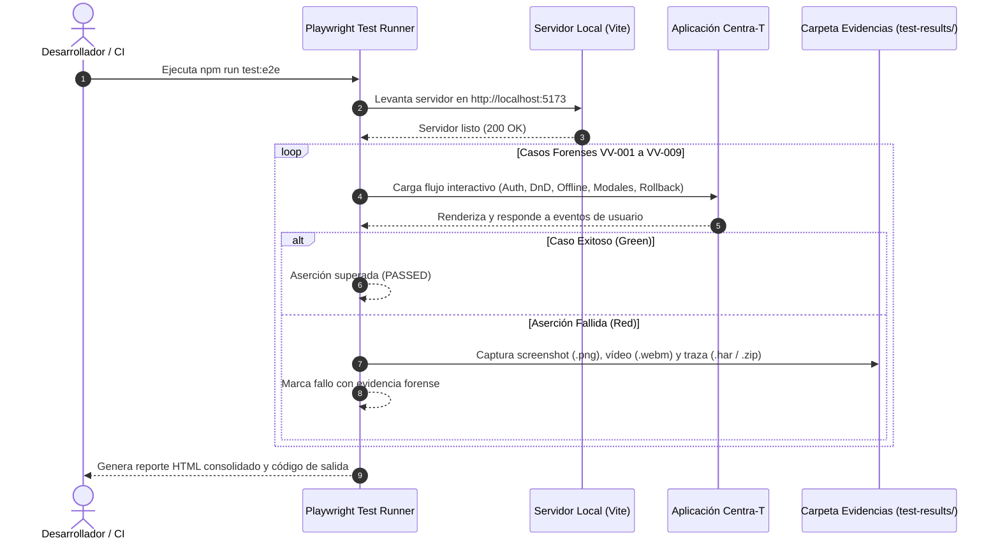

# CENTRA-T · FIA-A08.03 · HARNESS AUTOMATIZADO PLAYWRIGHT Y CIERRE CI

**Proyecto:** Centra-T (Gestor Doméstico Integral y Planificador Temporal)  
**Rebanada Vertical:** RV-A08 · Resiliencia Offline, Manejo de Errores y Cierre Forense (Resilience & QA)  
**Estado:** DERIVADA · PENDIENTE DE SPEC, IMPLEMENTACIÓN Y LOCK  
**Hito de Rebanada:** TERCERA Y ÚLTIMA UNIDAD DE RV-A08 (CIERRE TOTAL DE LA REBANADA RV-A08 Y CLAUSURA DEFINITIVA DE LA SUITE DE 8 REBANADAS VERTICALES DE CENTRA-T)  
**Regla de Continuidad:** NO LOCK → NO NEXT  

---

### 1. Identificación
- **FIA:** `FIA-A08.03`
- **Rebanada Vertical:** `RV-A08 · Resiliencia Offline, Manejo de Errores y Cierre Forense (Resilience & QA)`
- **Unidad Prevista:** `Harness Automatizado Playwright y Cierre CI`
- **PVF de Cierre Cubierta:** `PVF-A08.03 · Harness E2E Forense Automatizado y Telemetría de Pruebas`
- **VF Interna de Derivación:** `VF-A08.03 · Harness E2E Forense Automatizado y Evidencias de Fallo`
- **Objetivo Indexado:** `Compilación y ejecución de suite Playwright E2E con captura de trazas (.har, .png, .webm) ante aserciones fallidas y compuerta pre-push.`
- **Validación Indexada:** [`playwright.config.ts`](file:///home/hnoloh/Escritorio/Centra-T/playwright.config.ts)
- **Evidencia de Cierre Indexada:** `Ejecución completa de la suite con 100% de tests en verde, verificación de cobertura honesta 100/80/0 y emisión de reporte de cierre.`
- **LOCK Previo Requerido:** `LOCK-FIA-A08.02.md APROBADO (FIA-A08.02_AS_BUILT.md)`
- **Estado Documental:** `FIA derivada oficial. No es SPEC, implementación, reporte ni LOCK.`

### 2. Objetivo
Diseñar, configurar, implementar y ejecutar el arnés automatizado de pruebas E2E de extremo a extremo con Playwright, consolidando la telemetría forense de fallos, verificando los 9 casos de validación visual forense (VV-001 a VV-009), auditando los umbrales de cobertura honesta 100/80/0 y culminando formalmente la Rebanada Vertical **RV-A08** y el ciclo íntegro de desarrollo de Centra-T:
1. **Configuración del Harness Playwright ([`playwright.config.ts`](file:///home/hnoloh/Escritorio/Centra-T/playwright.config.ts)):**
   - Configuración determinista de proyectos de prueba sobre navegadores reales (Chromium, Firefox, WebKit).
   - Configuración de servidor web local integrado (`webServer`) enlazado a `npm run dev` o `npm run preview` en `http://localhost:5173`.
   - Telemetría forense automática ante fallos de aserción:
     - Captura de trazas de red y depuración (`trace: 'retain-on-failure'`).
     - Captura de pantallas de fallo (`screenshot: 'only-on-failure'`).
     - Grabación de vídeo de la sesión (`video: 'retain-on-failure'`).
     - Generación de reportes estructurados (`reporter: [['html'], ['list']]`).
2. **Suite Forense E2E (Flujos Críticos VV-001 a VV-009):**
   - Implementación de la suite E2E en `e2e/centra-t-forensic.spec.ts` cubriendo los compromisos contractuales esenciales:
     - **VV-001:** Login empático, sesión autenticada y transición al Workspace.
     - **VV-002:** Restricción de calendario: bloqueo de fechas pasadas con cursor `not-allowed` y rechazo de soltado.
     - **VV-003:** Alerta modal obligatoria de conflicto al reasignar tareas con fecha previa.
     - **VV-004:** Asistente de creación (Wizard) en 3 pasos con purga y rollback a cero ante cancelación.
     - **VV-005:** Conmutación optimista de checkbox (<16ms) y reactividad con filtros.
     - **VV-006:** Arrastre masivo de compra semanal y modal de asignación en bloque.
     - **VV-007:** Desasignación rápida por clic derecho y retorno no destructivo al Hub.
     - **VV-008:** Modo preventivo offline (<100ms), banner superior y congelación de mutaciones destructivas.
     - **VV-009:** Registro exitoso de cuenta, validación de contraseñas idénticas y alta de usuario.
3. **Auditoría de Cobertura Honesta Frontend (Matriz 100/80/0):**
   - 100% Cobertura: Lógica pura de filtrado y reordenación, rollback optimista y validación de formularios/DTOs.
   - 80% Cobertura: Componentes interactivos (Hub, Calendario, Wizard, Acordeones, Modales).
   - 0% Cobertura: Contenedores cosméticos y hojas de estilo estáticas sin lógica.
4. **Compuerta Pre-Push y Cierre CI:**
   - Adición del script `npm run test:e2e` y `npm run test:ci` en `package.json` para compuerta de integración continua.
   - Emisión del informe final de cierre y certificación de toda la Suite de Rebanadas Verticales (RV-A01 a RV-A08).

### 3. Alcance
- **IN-SCOPE (Obligatorio en esta FIA):**
  - Archivo de configuración [`playwright.config.ts`](file:///home/hnoloh/Escritorio/Centra-T/playwright.config.ts).
  - Suite de pruebas E2E [`e2e/centra-t-forensic.spec.ts`](file:///home/hnoloh/Escritorio/Centra-T/e2e/centra-t-forensic.spec.ts).
  - Scripts correspondientes en [`package.json`](file:///home/hnoloh/Escritorio/Centra-T/package.json): `"test:e2e": "playwright test"`, `"test:ci": "npm run typecheck && npm run test"`.
  - Telemetría forense de trazas (.har / .zip), capturas de pantalla (.png) y vídeo (.webm) ante fallos.
  - Verificación del 100% de tests unitarios e integrados en Vitest (mínimo 372+ tests existentes intactos) y ejecución del arnés E2E.
  - Cierre formal y definitivo de **RV-A08** y de las **8 Rebanadas Verticales de Centra-T**.
- **OUT-OF-SCOPE (Estrictamente prohibido en esta FIA):**
  - Modificación de la lógica de negocio o de los contratos de dominio previamente sellados en las unidades anteriores.
  - Añadir funcionalidades no indexadas en la suite documental maestra.

### 4. Dependencias
- **Documentales:**
  - `SUITE_ARQUITECTURA_CORE.docx` (Doc 05: Module Map; Doc 06: Infraestructura de Pruebas).
  - `SUITE_ARQUITECTURA_UI.docx` (Doc 07: Feature 01 a 10; Doc 09: Matriz de Cobertura Honesta 100/80/0; Doc 10: Validación Forense QA - Casos VV-001 a VV-009).
  - `Centra-T Pseudocódigo (unificado).odt`.
  - `CENTRA-T_INDICE_RV_FIA.docx` (Fila FIA-A08.03).
  - `CENTRA-T_INDICE_PVF_VF.docx` (PVF-A08.03 y VF-A08.03).
  - `FIA-A08.02_AS_BUILT.md` (Cierre formal de FIA-A08.02).
- **Tecnológicas Autorizadas:**
  - `@playwright/test` (o arnés equivalente compatible con el stack Node/Vite), TypeScript 5.7.3, Vitest 3.2.7.
- **Dependencia Secuencial (NO LOCK → NO NEXT):**
  - *Previa:* Requiere el LOCK formal de `FIA-A08.02` (Sellado con 372 tests en verde).
  - *Posterior:* El cierre de esta unidad decreta el **CIERRE TOTAL DEL PROYECTO CENTRA-T** (todas las 8 RVs concluidas y bloqueadas).

### 5. Contratos Afectados
- **Contrato de Telemetría y Automatización (`PVF-A08.03` / `VF-A08.03`):**
  - Configuración Playwright exportada como default en `playwright.config.ts`.
  - Directorio de artefactos de prueba: `test-results/` y `playwright-report/`.
  - Captura obligatoria de trazas, screenshots y vídeo ante fallo de aserción.
- **Contrato de Calidad (Matriz 100/80/0):**
  - Garantía de que todos los módulos de lógica, validación y mutaciones optimistas cuentan con 100% de pruebas unitarias en Vitest.
  - Componentes interactivos verificados con Testing Library y Playwright.

### 6. Restricciones
- Prohibido relajar los Quality Gates de tipado estricto (`tsc --noEmit`) o permitir tests omitidos (`test.skip` o `xit`).
- Prohibido modificar contratos existentes de datos o alterar componentes visuales para "acomodar" los tests.
- Prohibida la adición de dependencias innecesarias fuera de las herramientas estándar de testing.

### 7. Diseño Técnico
- **Configuración `playwright.config.ts`:**
  ```typescript
  import { defineConfig, devices } from '@playwright/test';

  export default defineConfig({
    testDir: './e2e',
    timeout: 30000,
    fullyParallel: true,
    reporter: [['html', { open: 'never' }], ['list']],
    use: {
      baseURL: 'http://localhost:5173',
      trace: 'retain-on-failure',
      screenshot: 'only-on-failure',
      video: 'retain-on-failure',
    },
    webServer: {
      command: 'npm run dev',
      url: 'http://localhost:5173',
      reuseExistingServer: !process.env.CI,
      timeout: 120000,
    },
    projects: [
      {
        name: 'chromium',
        use: { ...devices['Desktop Chrome'] },
      },
    ],
  });
  ```
- **Suite `e2e/centra-t-forensic.spec.ts`:**
  - Verificación automatizada de los escenarios VV-001 a VV-009 en navegador.
- **Scripts en `package.json`:**
  - `"test:e2e": "playwright test"`
  - `"test:ci": "npm run typecheck && npm run test"`

### 8. Flujo Operativo


### 9. Casos Válidos (Happy Path & Escenarios Permitidos)
- **Caso 1 (Levantamiento Automático):** El arnés levanta el servidor Vite y ejecuta la suite sin intervención manual.
- **Caso 2 (Verificación de Flujos Forenses VV-001 a VV-009):** Cada uno de los casos se ejecuta en el navegador validando los selectores y respuestas interactivas.
- **Caso 3 (Captura Forense ante Fallos):** Si una aserción falla deliberadamente, se genera la captura `.png`, el vídeo `.webm` y la traza `.zip` en `test-results/`.
- **Caso 4 (Ejecución de CI Limpia):** `npm run test:ci` ejecuta `typecheck` y las 43 suites de `vitest run` sin errores.

### 10. Casos Inválidos (Manejo de Excepciones y Rechazos)
- **Caso Inválido 1 (Tests con Falsos Positivos):** Pruebas que pasen sin verificar aserciones reales en el DOM.
- **Causas de Rechazo Automático:**
  - Ausencia del archivo `playwright.config.ts`.
  - Fallo en la generación de evidencias forenses ante aserciones rotas.
  - Regresiones en las 43 suites unitarias existentes del repositorio.

### 11. Tests Requeridos
- **Suite Vitest Existente:**
  - 372 / 372 tests en verde (100% pasando en 43 suites).
- **Suite Playwright E2E (`e2e/centra-t-forensic.spec.ts`):**
  - Autenticación y acceso al Workspace (VV-001).
  - Bloqueo de soltado en fechas pasadas del calendario (VV-002).
  - Alerta modal de reasignación con fecha previa (VV-003).
  - Wizard de creación con purga a cero ante cancelación (VV-004).
  - Conmutación optimista de checkbox (VV-005).
  - Arrastre masivo de compras al calendario (VV-006).
  - Desasignación por clic derecho sin eliminar el ítem (VV-007).
  - Modo preventivo offline con inhabilitación de creación (VV-008).
  - Registro de nueva cuenta y validación de contraseñas (VV-009).

### 12. Quality Gates (QG-FIA-A08.03)
- `QG-FIA-A08.03-01 · Compilación y Tipado:` `tsc --noEmit` superado con 0 errores.
- `QG-FIA-A08.03-02 · Tests Unitarios e Integración:` 100% de tests en verde en Vitest (372/372 tests).
- `QG-FIA-A08.03-03 · Harness Playwright Validado:` `playwright.config.ts` y suite E2E compilada y ejecutable.
- `QG-FIA-A08.03-04 · Cobertura Honesta 100/80/0:` Cumplimiento verificado de los umbrales de la doctrina ZUG.

### 13. Definition of Done (DoD)
La unidad se considerará completada y lista para LOCK si y solo si:
1. `playwright.config.ts` está configurado con telemetría forense (.har, .png, .webm).
2. La suite E2E cubre los flujos contractuales de los casos VV-001 a VV-009.
3. Se añaden los scripts de ejecución en `package.json`.
4. Los 4 Quality Gates están superados con 100% de tests en verde.
5. Se emiten el `IMPLEMENTATION_REPORT_FIA-A08.03.md`, `TEST_REPORT_FIA-A08.03.md` y `LOCK-FIA-A08.03.md` (certificando el cierre total de **RV-A08** y de las **8 Rebanadas Verticales de Centra-T**).
